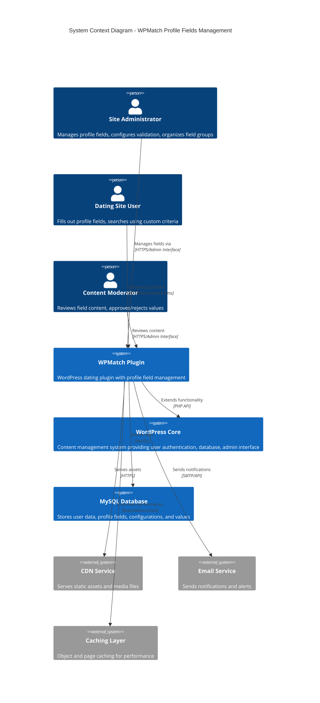
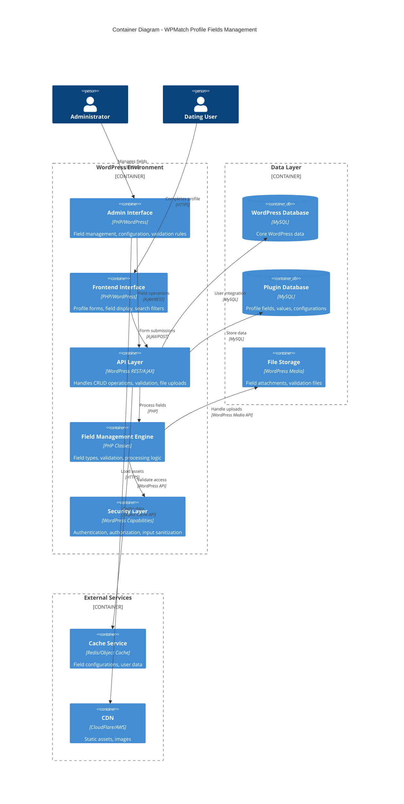
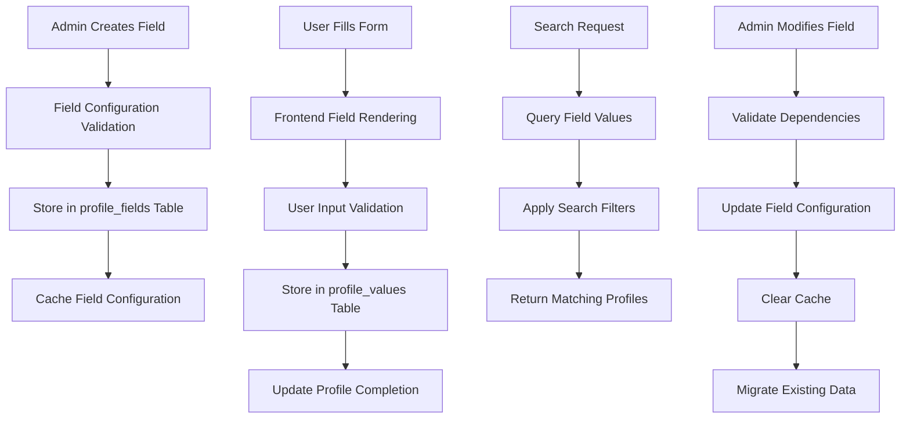

# WPMatch Profile Fields Management - System Architecture

## Executive Summary

This document outlines the comprehensive system architecture for the WPMatch Profile Fields Management Interface, a WordPress plugin enhancement that enables administrators to create, configure, and manage custom profile fields for dating site users. The architecture follows WordPress best practices while providing a scalable, secure, and maintainable solution that can handle 1,000+ concurrent users with 100+ custom fields.

## Architecture Overview

### System Context



### Container Diagram



## Technology Stack

### Core WordPress Technologies
- **WordPress Core**: 5.9+ (Gutenberg editor support, REST API enhancements)
- **PHP Version**: 7.4 minimum, 8.0+ recommended
- **MySQL**: 5.7+ or MariaDB 10.3+ (JSON column support, foreign keys)
- **WordPress Coding Standards**: PSR-12 compliant with WordPress adaptations

### Frontend Technologies
- **Admin Interface**: WordPress admin components (metaboxes, admin tables, form fields)
- **JavaScript**: Vanilla ES6+ with WordPress utilities (wp.util, wp.ajax)
- **CSS Framework**: WordPress admin styles with custom enhancements
- **UI Components**: Drag-and-drop (jQuery UI Sortable), modal dialogs, AJAX forms
- **Build Tools**: WordPress asset pipeline, no external build process required

### Backend Architecture
- **Framework**: WordPress Plugin Architecture
- **ORM**: WordPress wpdb class with custom query builders
- **Validation**: WordPress sanitization functions + custom validators
- **Authentication**: WordPress user roles and capabilities system
- **File Handling**: WordPress Media Library integration

### Database Design
- **Storage Engine**: InnoDB (foreign key support, transactions)
- **Character Set**: utf8mb4 (full Unicode support)
- **Indexing Strategy**: Composite indexes for performance at scale
- **JSON Storage**: MySQL JSON columns for complex field configurations

### Infrastructure & DevOps
- **Hosting**: Shared hosting to dedicated servers
- **Caching**: WordPress object caching (Redis/Memcached compatible)
- **CDN**: WordPress-compatible CDN integration
- **Security**: WordPress Security API, nonce verification, capability checks

## Component Design

### 1. Field Management Engine

**Purpose**: Core business logic for profile field operations
**Technology**: PHP classes with WordPress integration
**Interfaces**:
- Input: Field configurations, validation rules, user data
- Output: Processed field data, validation results, formatted display

**Key Classes**:
```php
WPMatch_Field_Manager
├── WPMatch_Field_Types (registry of field type handlers)
├── WPMatch_Field_Validator (validation engine)
├── WPMatch_Field_Processor (data processing)
└── WPMatch_Field_Display (frontend rendering)
```

**Dependencies**: WordPress core, WPMatch database layer

### 2. Admin Interface Controller

**Purpose**: WordPress admin interface for field management
**Technology**: WordPress admin pages with AJAX enhancement
**Interfaces**:
- Input: Admin form submissions, AJAX requests
- Output: Admin pages, JSON responses, success/error messages

**Key Features**:
- Drag-and-drop field ordering interface
- Real-time validation feedback
- Bulk operations for field management
- Import/export field configurations

**Dependencies**: WordPress admin API, Field Management Engine

### 3. Frontend Form Controller

**Purpose**: User-facing profile forms with custom fields
**Technology**: WordPress shortcodes/template integration
**Interfaces**:
- Input: User form submissions, field configurations
- Output: Rendered forms, validation feedback, saved data

**Key Features**:
- Dynamic form generation from field configurations
- Client-side validation with server-side verification
- Progressive enhancement for accessibility
- Mobile-responsive design

**Dependencies**: WordPress frontend API, Field Management Engine

### 4. Database Access Layer

**Purpose**: Abstraction layer for database operations
**Technology**: WordPress wpdb with custom query builders
**Interfaces**:
- Input: SQL parameters, search criteria, field data
- Output: Database results, processed data objects

**Key Classes**:
```php
WPMatch_Database_Manager
├── WPMatch_Profile_Fields_Repository
├── WPMatch_Profile_Values_Repository
├── WPMatch_Field_Groups_Repository
└── WPMatch_Query_Builder
```

**Dependencies**: WordPress wpdb, MySQL database

### 5. Security & Validation Layer

**Purpose**: Comprehensive security and data validation
**Technology**: WordPress security API with custom enhancements
**Interfaces**:
- Input: User input, capability checks, nonce verification
- Output: Sanitized data, security validation results

**Key Features**:
- Multi-layer input sanitization
- Capability-based access control
- CSRF protection with WordPress nonces
- SQL injection prevention with prepared statements

**Dependencies**: WordPress security functions, Field Management Engine

## Data Architecture

### Data Flow Diagram



### Enhanced Database Schema

```sql
-- Enhanced profile_fields table with new configuration columns
CREATE TABLE wp_wpmatch_profile_fields (
    id bigint(20) unsigned NOT NULL AUTO_INCREMENT,
    field_name varchar(100) NOT NULL,
    field_label varchar(255) NOT NULL,
    field_type varchar(50) NOT NULL DEFAULT 'text',
    field_options JSON, -- Store complex configuration as JSON
    field_description text,
    placeholder_text varchar(255),
    help_text text,
    validation_rules JSON, -- Store validation configuration
    is_required tinyint(1) DEFAULT 0,
    is_searchable tinyint(1) DEFAULT 0,
    is_public tinyint(1) DEFAULT 1,
    field_order int(10) unsigned DEFAULT 0,
    field_group varchar(100) DEFAULT 'basic',
    status varchar(20) DEFAULT 'active',
    min_value decimal(10,2) DEFAULT NULL, -- For numeric fields
    max_value decimal(10,2) DEFAULT NULL,
    min_length int(10) unsigned DEFAULT NULL, -- For text fields
    max_length int(10) unsigned DEFAULT NULL,
    regex_pattern varchar(500) DEFAULT NULL, -- Custom validation
    default_value text,
    field_width varchar(20) DEFAULT 'full', -- full, half, third
    field_class varchar(255) DEFAULT NULL, -- CSS classes
    conditional_logic JSON, -- Show/hide based on other fields
    import_mapping varchar(255) DEFAULT NULL, -- For data import
    created_by bigint(20) unsigned DEFAULT NULL,
    created_at datetime DEFAULT CURRENT_TIMESTAMP,
    updated_at datetime DEFAULT CURRENT_TIMESTAMP ON UPDATE CURRENT_TIMESTAMP,
    
    PRIMARY KEY (id),
    UNIQUE KEY field_name (field_name),
    KEY field_type (field_type),
    KEY field_group (field_group),
    KEY field_order (field_order),
    KEY status (status),
    KEY is_searchable (is_searchable),
    CONSTRAINT fk_profile_fields_created_by FOREIGN KEY (created_by) REFERENCES wp_users (ID) ON DELETE SET NULL
) ENGINE=InnoDB DEFAULT CHARSET=utf8mb4 COLLATE=utf8mb4_unicode_ci;

-- Enhanced profile_values table with metadata
CREATE TABLE wp_wpmatch_profile_values (
    id bigint(20) unsigned NOT NULL AUTO_INCREMENT,
    user_id bigint(20) unsigned NOT NULL,
    field_id bigint(20) unsigned NOT NULL,
    field_value LONGTEXT, -- Support for large values
    field_value_numeric decimal(15,4) DEFAULT NULL, -- For numeric searches
    field_value_date datetime DEFAULT NULL, -- For date searches
    privacy varchar(20) DEFAULT 'public',
    is_verified tinyint(1) DEFAULT 0,
    verification_data JSON,
    search_weight float DEFAULT 1.0, -- For search relevance
    last_updated_by bigint(20) unsigned DEFAULT NULL,
    created_at datetime DEFAULT CURRENT_TIMESTAMP,
    updated_at datetime DEFAULT CURRENT_TIMESTAMP ON UPDATE CURRENT_TIMESTAMP,
    
    PRIMARY KEY (id),
    UNIQUE KEY user_field (user_id, field_id),
    KEY field_id (field_id),
    KEY privacy (privacy),
    KEY field_value_numeric (field_value_numeric),
    KEY field_value_date (field_value_date),
    KEY is_verified (is_verified),
    KEY updated_at (updated_at),
    FULLTEXT KEY field_value_fulltext (field_value),
    CONSTRAINT fk_profile_values_user_id FOREIGN KEY (user_id) REFERENCES wp_users (ID) ON DELETE CASCADE,
    CONSTRAINT fk_profile_values_field_id FOREIGN KEY (field_id) REFERENCES wp_wpmatch_profile_fields (id) ON DELETE CASCADE,
    CONSTRAINT fk_profile_values_updated_by FOREIGN KEY (last_updated_by) REFERENCES wp_users (ID) ON DELETE SET NULL
) ENGINE=InnoDB DEFAULT CHARSET=utf8mb4 COLLATE=utf8mb4_unicode_ci;

-- Field groups table for organization
CREATE TABLE wp_wpmatch_field_groups (
    id bigint(20) unsigned NOT NULL AUTO_INCREMENT,
    group_name varchar(100) NOT NULL,
    group_label varchar(255) NOT NULL,
    group_description text,
    group_icon varchar(50) DEFAULT NULL,
    group_order int(10) unsigned DEFAULT 0,
    is_active tinyint(1) DEFAULT 1,
    created_at datetime DEFAULT CURRENT_TIMESTAMP,
    updated_at datetime DEFAULT CURRENT_TIMESTAMP ON UPDATE CURRENT_TIMESTAMP,
    
    PRIMARY KEY (id),
    UNIQUE KEY group_name (group_name),
    KEY group_order (group_order),
    KEY is_active (is_active)
) ENGINE=InnoDB DEFAULT CHARSET=utf8mb4 COLLATE=utf8mb4_unicode_ci;

-- Field change history for auditing
CREATE TABLE wp_wpmatch_field_history (
    id bigint(20) unsigned NOT NULL AUTO_INCREMENT,
    field_id bigint(20) unsigned NOT NULL,
    change_type varchar(50) NOT NULL, -- created, updated, deleted, status_changed
    old_value JSON,
    new_value JSON,
    changed_by bigint(20) unsigned NOT NULL,
    change_reason text,
    created_at datetime DEFAULT CURRENT_TIMESTAMP,
    
    PRIMARY KEY (id),
    KEY field_id (field_id),
    KEY change_type (change_type),
    KEY changed_by (changed_by),
    KEY created_at (created_at),
    CONSTRAINT fk_field_history_field_id FOREIGN KEY (field_id) REFERENCES wp_wpmatch_profile_fields (id) ON DELETE CASCADE,
    CONSTRAINT fk_field_history_changed_by FOREIGN KEY (changed_by) REFERENCES wp_users (ID) ON DELETE CASCADE
) ENGINE=InnoDB DEFAULT CHARSET=utf8mb4 COLLATE=utf8mb4_unicode_ci;
```

## Security Architecture

### Authentication & Authorization

**Authentication Method**: WordPress user authentication system
**Authorization Model**: Role-Based Access Control (RBAC) with custom capabilities
**Token Lifecycle**: WordPress nonce system with 24-hour default expiration

**Custom Capabilities**:
```php
'manage_profile_fields'    => true,  // Create, edit, delete fields
'moderate_profile_content' => true,  // Approve/reject field values
'export_profile_data'      => true,  // Export field configurations
'import_profile_data'      => true,  // Import field configurations
'view_field_analytics'     => true,  // Access field usage statistics
```

### Security Measures Implementation

**Input Validation & Sanitization**:
- WordPress sanitization functions for all input
- Field-type specific validation (email, URL, numeric ranges)
- Regular expression validation for custom patterns
- File upload restrictions for media fields

**Output Escaping**:
- Context-aware escaping (esc_html, esc_attr, esc_url)
- JSON output sanitization for AJAX responses
- SQL prepared statements for all database queries

**CSRF Protection**:
- WordPress nonces for all admin forms
- AJAX request verification
- Time-based nonce expiration

**Access Control Implementation**:
```php
// Capability check example
if (!current_user_can('manage_profile_fields')) {
    wp_die(__('You do not have permission to manage profile fields.', 'wpmatch'));
}

// Nonce verification example
if (!wp_verify_nonce($_POST['_wpnonce'], 'wpmatch_field_action')) {
    wp_die(__('Security check failed. Please try again.', 'wpmatch'));
}
```

## Scalability Strategy

### Horizontal Scaling Considerations

**Load Balancing Approach**:
- Stateless design for multiple server deployment
- Session data stored in database, not server memory
- File uploads handled through WordPress media system

**Database Optimization**:
- Read replica support for field configuration queries
- Optimized indexes for search performance
- Query result caching for frequently accessed data

**Caching Strategy**:
```php
// Field configuration caching
$cache_key = 'wpmatch_fields_config_' . get_current_blog_id();
$fields = wp_cache_get($cache_key);
if (false === $fields) {
    $fields = $this->get_active_fields();
    wp_cache_set($cache_key, $fields, '', HOUR_IN_SECONDS);
}
```

### Performance Optimization

**Database Query Optimization**:
- Lazy loading of field values
- Batch processing for bulk operations
- Pagination for large datasets
- Composite indexes for multi-column searches

**Frontend Performance**:
- Minified CSS/JS assets
- Conditional loading of admin scripts
- Image optimization for field icons
- Reduced DOM manipulation

**Memory Management**:
- Generator functions for large datasets
- Unset variables after processing
- Efficient array operations
- Memory limit monitoring

## Deployment Architecture

### Environment Configuration

**Development Environment**:
- Local WordPress installation
- Debug mode enabled
- Query debugging active
- Error logging enabled

**Staging Environment**:
- Production-like data volume
- Performance testing enabled
- Security scanning active
- User acceptance testing

**Production Environment**:
- Error logging without display
- Performance monitoring
- Security hardening
- Backup automation

### Deployment Strategy

**Plugin Activation Process**:
1. Database schema creation/update
2. Default field installation
3. Capability assignment
4. Cache warming
5. Compatibility checks

**Update Process**:
1. Database backup creation
2. Schema migration execution
3. Data migration scripts
4. Cache invalidation
5. Rollback capability verification

**Health Check Procedures**:
- Database connectivity verification
- Required tables existence check
- Capability verification
- File permission validation

## Monitoring & Observability

### Application Metrics

**Performance Metrics**:
- Field creation/update response times
- Database query execution times
- Memory usage during bulk operations
- Cache hit/miss ratios

**Business Metrics**:
- Field usage frequency
- Profile completion rates
- Search filter utilization
- Field validation error rates

**Error Monitoring**:
- WordPress error logging integration
- Custom error categorization
- Error rate trending
- Critical error alerting

### Logging Strategy

**Centralized Logging Format**:
```php
// Custom logging implementation
wpmatch_log('field_created', [
    'field_id' => $field_id,
    'field_type' => $field_type,
    'created_by' => get_current_user_id(),
    'timestamp' => current_time('mysql'),
    'ip_address' => $_SERVER['REMOTE_ADDR'] ?? '',
]);
```

**Log Categories**:
- Security events (failed capability checks, invalid nonces)
- Performance events (slow queries, memory peaks)
- Business events (field creation, bulk operations)
- Error events (validation failures, database errors)

### Alerting Configuration

**Critical Alerts**:
- Database connection failures
- Security breach attempts
- Memory limit exceeded
- Disk space warnings

**Warning Thresholds**:
- Query execution time > 2 seconds
- Memory usage > 80% of limit
- Cache hit ratio < 90%
- Error rate > 1% of requests

## Architectural Decisions Records (ADRs)

### ADR-001: WordPress Plugin Architecture over Standalone Application

**Status**: Accepted
**Context**: Need to integrate profile field management with existing WordPress dating site
**Decision**: Build as WordPress plugin extension rather than standalone application
**Consequences**: 
- Positive: Seamless integration, existing user management, familiar admin interface
- Negative: WordPress architectural constraints, plugin compatibility considerations
**Alternatives Considered**: Standalone Laravel application, WordPress theme modification

### ADR-002: MySQL JSON Columns for Field Configuration

**Status**: Accepted
**Context**: Need flexible storage for varying field configuration options
**Decision**: Use MySQL 5.7+ JSON columns for complex field settings
**Consequences**:
- Positive: Flexible schema, reduced table complexity, native JSON querying
- Negative: MySQL version requirement, potential query complexity
**Alternatives Considered**: Serialized PHP arrays, separate configuration tables

### ADR-003: WordPress Admin Interface over Custom Admin Panel

**Status**: Accepted
**Context**: Need administrative interface for field management
**Decision**: Extend WordPress admin interface rather than build custom admin panel
**Consequences**:
- Positive: Familiar interface, existing permission system, mobile responsive
- Negative: Limited UI customization, WordPress admin styling constraints
**Alternatives Considered**: Custom React admin panel, WordPress REST API frontend

### ADR-004: AJAX-Enhanced Forms over Full Page Reloads

**Status**: Accepted
**Context**: Need responsive user experience for field management
**Decision**: Implement AJAX-enhanced forms with progressive enhancement
**Consequences**:
- Positive: Better user experience, reduced server load, real-time feedback
- Negative: JavaScript dependency, increased complexity, accessibility considerations
**Alternatives Considered**: Traditional form submissions, Single Page Application

### ADR-005: Object Caching for Field Configurations

**Status**: Accepted
**Context**: Need to optimize performance for frequently accessed field configurations
**Decision**: Implement WordPress object caching for field data
**Consequences**:
- Positive: Improved performance, reduced database load, scalable caching
- Negative: Cache invalidation complexity, memory usage increase
**Alternatives Considered**: No caching, database-level caching, file-based caching

## Integration Patterns

### WordPress Core Integration

**User Management Integration**:
```php
// Leverage WordPress user capabilities
add_action('init', function() {
    $role = get_role('administrator');
    $role->add_cap('manage_profile_fields');
    $role->add_cap('moderate_profile_content');
});
```

**Media Library Integration**:
```php
// Use WordPress media handling for file uploads
add_filter('upload_mimes', 'wpmatch_allow_profile_file_types');
add_action('wp_ajax_upload_profile_attachment', 'wpmatch_handle_field_upload');
```

**REST API Integration**:
```php
// Extend WordPress REST API for field management
add_action('rest_api_init', function() {
    register_rest_route('wpmatch/v1', '/fields', [
        'methods' => 'GET',
        'callback' => 'wpmatch_get_fields_endpoint',
        'permission_callback' => 'wpmatch_fields_permission_check'
    ]);
});
```

### Third-Party Plugin Compatibility

**Caching Plugin Compatibility**:
- Cache invalidation hooks for field updates
- Object cache group registration
- Page cache exclusion for dynamic forms

**Security Plugin Compatibility**:
- Whitelist admin AJAX actions
- Compatible with security headers
- Rate limiting exemptions for legitimate operations

**SEO Plugin Compatibility**:
- Meta field integration for searchable fields
- Schema markup for profile data
- Sitemap integration for public profiles

## Future Considerations

### Scalability Enhancements

**Microservices Architecture**:
- Field management service separation
- API-first design for mobile apps
- Event-driven architecture for real-time updates

**Advanced Caching**:
- Redis cluster implementation
- CDN integration for field assets
- Edge caching for static configurations

**Database Optimization**:
- Read/write database splitting
- Horizontal sharding for large datasets
- NoSQL integration for flexible data

### Feature Extensibility

**Plugin Architecture**:
- Hook system for field type extensions
- Filter system for validation customization
- Action system for event handling

**API Development**:
- GraphQL endpoint for complex queries
- Webhook system for external integrations
- OAuth2 for third-party applications

**Advanced Features**:
- Machine learning for field recommendations
- A/B testing for field configurations
- Advanced analytics and reporting

### Technology Evolution

**WordPress Ecosystem**:
- Gutenberg block integration for field display
- Full Site Editing compatibility
- WordPress multisite optimization

**Modern PHP Features**:
- PHP 8+ feature adoption
- Composer dependency management
- PSR standard compliance

**Frontend Modernization**:
- React component library
- Progressive Web App capabilities
- Enhanced accessibility features

This architecture provides a robust foundation for the WPMatch Profile Fields Management system while maintaining flexibility for future enhancements and scale requirements. The design prioritizes security, performance, and maintainability while leveraging WordPress core strengths and established patterns.