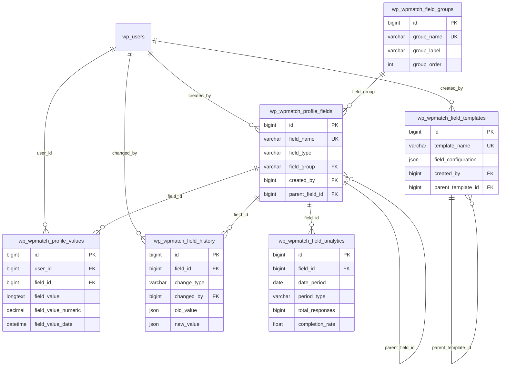

# WPMatch Profile Fields Management - Database Schema Design

## Overview

This document provides a comprehensive database schema design for the WPMatch Profile Fields Management system. The schema extends the existing WPMatch database structure with enhanced field configuration capabilities, supporting 8+ field types, advanced validation, conditional logic, and analytics tracking while maintaining data integrity and performance at scale.

## Schema Design Principles

### 1. Data Integrity
- **Foreign Key Constraints**: Maintain referential integrity across all tables
- **Cascading Deletes**: Proper cleanup of related data when parent records are deleted
- **Check Constraints**: Enforce business rules at the database level
- **JSON Schema Validation**: Validate complex JSON configurations

### 2. Performance Optimization
- **Strategic Indexing**: Composite indexes for common query patterns
- **Partitioning Ready**: Schema designed to support table partitioning
- **Denormalization**: Strategic denormalization for frequently accessed data
- **Query Optimization**: Index design optimized for search and analytics

### 3. Scalability Considerations
- **Flexible Field Storage**: JSON columns for extensible field configurations
- **Search Optimization**: Dedicated columns for searchable values
- **Audit Trail**: Change tracking for compliance and debugging
- **Archive Strategy**: Soft deletes and archival capabilities

## Enhanced Database Schema

### 1. Profile Fields Configuration Table

```sql
-- Enhanced profile_fields table with comprehensive configuration
CREATE TABLE wp_wpmatch_profile_fields (
    -- Primary identification
    id bigint(20) unsigned NOT NULL AUTO_INCREMENT,
    field_name varchar(100) NOT NULL COMMENT 'Unique field identifier (snake_case)',
    field_label varchar(255) NOT NULL COMMENT 'Human-readable field label',
    field_type varchar(50) NOT NULL DEFAULT 'text' COMMENT 'Field type (text, select, number, etc.)',
    
    -- Display and UX configuration
    field_description text COMMENT 'Field description for users',
    placeholder_text varchar(255) COMMENT 'Placeholder text for form inputs',
    help_text text COMMENT 'Help text displayed with field',
    field_icon varchar(50) COMMENT 'Dashicon or CSS class for field icon',
    
    -- Field configuration (JSON columns for flexibility)
    field_options JSON COMMENT 'Field type specific options (choices, formats, etc.)',
    validation_rules JSON COMMENT 'Validation configuration (required, min/max, regex)',
    display_options JSON COMMENT 'Display configuration (width, CSS classes, etc.)',
    conditional_logic JSON COMMENT 'Show/hide logic based on other fields',
    
    -- Field behavior flags
    is_required tinyint(1) DEFAULT 0 COMMENT 'Required field flag',
    is_searchable tinyint(1) DEFAULT 0 COMMENT 'Include in search filters',
    is_public tinyint(1) DEFAULT 1 COMMENT 'Visible in public profiles',
    is_editable tinyint(1) DEFAULT 1 COMMENT 'Users can edit this field',
    is_system tinyint(1) DEFAULT 0 COMMENT 'System field (cannot be deleted)',
    
    -- Organization and ordering
    field_group varchar(100) DEFAULT 'basic' COMMENT 'Field group for organization',
    field_order int(10) unsigned DEFAULT 0 COMMENT 'Display order within group',
    parent_field_id bigint(20) unsigned DEFAULT NULL COMMENT 'Parent field for subfields',
    
    -- Status and lifecycle
    status varchar(20) DEFAULT 'active' COMMENT 'active, inactive, draft, deprecated',
    
    -- Validation constraints
    min_value decimal(15,4) DEFAULT NULL COMMENT 'Minimum value for numeric fields',
    max_value decimal(15,4) DEFAULT NULL COMMENT 'Maximum value for numeric fields',
    min_length int(10) unsigned DEFAULT NULL COMMENT 'Minimum length for text fields',
    max_length int(10) unsigned DEFAULT NULL COMMENT 'Maximum length for text fields',
    regex_pattern varchar(500) DEFAULT NULL COMMENT 'Custom validation regex',
    
    -- Default and computed values
    default_value text COMMENT 'Default field value',
    computed_value JSON COMMENT 'Configuration for computed/calculated fields',
    
    -- Display formatting
    field_width varchar(20) DEFAULT 'full' COMMENT 'full, half, third, quarter',
    field_class varchar(255) DEFAULT NULL COMMENT 'Additional CSS classes',
    field_style text COMMENT 'Inline CSS styles',
    
    -- Import/export and migration
    import_mapping varchar(255) DEFAULT NULL COMMENT 'External system field mapping',
    migration_data JSON COMMENT 'Data migration configuration',
    
    -- Analytics and usage tracking
    usage_count bigint(20) unsigned DEFAULT 0 COMMENT 'Number of users with values',
    last_used_at datetime DEFAULT NULL COMMENT 'Last time field was used',
    
    -- Audit and metadata
    created_by bigint(20) unsigned DEFAULT NULL COMMENT 'User who created the field',
    updated_by bigint(20) unsigned DEFAULT NULL COMMENT 'User who last updated the field',
    created_at datetime DEFAULT CURRENT_TIMESTAMP,
    updated_at datetime DEFAULT CURRENT_TIMESTAMP ON UPDATE CURRENT_TIMESTAMP,
    
    -- Primary key and constraints
    PRIMARY KEY (id),
    UNIQUE KEY field_name (field_name),
    
    -- Indexes for performance
    KEY idx_field_type (field_type),
    KEY idx_field_group (field_group),
    KEY idx_field_order (field_group, field_order),
    KEY idx_status (status),
    KEY idx_searchable (is_searchable),
    KEY idx_public (is_public),
    KEY idx_required (is_required),
    KEY idx_parent (parent_field_id),
    KEY idx_created_by (created_by),
    KEY idx_updated_by (updated_by),
    KEY idx_last_used (last_used_at),
    
    -- Composite indexes for common queries
    KEY idx_active_searchable (status, is_searchable),
    KEY idx_group_order_status (field_group, field_order, status),
    KEY idx_type_status (field_type, status),
    
    -- Foreign key constraints
    CONSTRAINT fk_profile_fields_created_by FOREIGN KEY (created_by) REFERENCES wp_users (ID) ON DELETE SET NULL,
    CONSTRAINT fk_profile_fields_updated_by FOREIGN KEY (updated_by) REFERENCES wp_users (ID) ON DELETE SET NULL,
    CONSTRAINT fk_profile_fields_parent FOREIGN KEY (parent_field_id) REFERENCES wp_wpmatch_profile_fields (id) ON DELETE CASCADE,
    
    -- Check constraints for data validation
    CONSTRAINT chk_field_name_format CHECK (field_name REGEXP '^[a-z][a-z0-9_]*[a-z0-9]$'),
    CONSTRAINT chk_field_type_valid CHECK (field_type IN ('text', 'textarea', 'select', 'multiselect', 'checkbox', 'radio', 'number', 'date', 'time', 'datetime', 'url', 'email', 'tel', 'file', 'image', 'range', 'color', 'rating')),
    CONSTRAINT chk_status_valid CHECK (status IN ('active', 'inactive', 'draft', 'deprecated', 'archived')),
    CONSTRAINT chk_field_width_valid CHECK (field_width IN ('full', 'half', 'third', 'quarter', 'auto')),
    CONSTRAINT chk_min_max_order CHECK (min_value IS NULL OR max_value IS NULL OR min_value <= max_value),
    CONSTRAINT chk_length_order CHECK (min_length IS NULL OR max_length IS NULL OR min_length <= max_length),
    CONSTRAINT chk_field_order CHECK (field_order >= 0),
    CONSTRAINT chk_usage_count CHECK (usage_count >= 0)
    
) ENGINE=InnoDB DEFAULT CHARSET=utf8mb4 COLLATE=utf8mb4_unicode_ci 
COMMENT='Profile field configuration and metadata';
```

### 2. Profile Values Storage Table

```sql
-- Enhanced profile_values table with optimized search and analytics
CREATE TABLE wp_wpmatch_profile_values (
    -- Primary identification
    id bigint(20) unsigned NOT NULL AUTO_INCREMENT,
    user_id bigint(20) unsigned NOT NULL COMMENT 'User who owns this value',
    field_id bigint(20) unsigned NOT NULL COMMENT 'Field this value belongs to',
    
    -- Value storage (multiple formats for optimization)
    field_value LONGTEXT COMMENT 'Raw field value (text, JSON, etc.)',
    field_value_numeric decimal(15,4) DEFAULT NULL COMMENT 'Numeric value for search/comparison',
    field_value_date datetime DEFAULT NULL COMMENT 'Date value for search/comparison',
    field_value_text varchar(1000) GENERATED ALWAYS AS (
        CASE 
            WHEN JSON_VALID(field_value) THEN 
                COALESCE(JSON_UNQUOTE(JSON_EXTRACT(field_value, '$.text')), 
                         SUBSTRING(field_value, 1, 1000))
            ELSE SUBSTRING(field_value, 1, 1000)
        END
    ) STORED COMMENT 'Extracted text for search',
    
    -- Privacy and access control
    privacy varchar(20) DEFAULT 'public' COMMENT 'public, members_only, private, custom',
    privacy_settings JSON COMMENT 'Advanced privacy configuration',
    
    -- Verification and quality
    is_verified tinyint(1) DEFAULT 0 COMMENT 'Value has been verified',
    is_featured tinyint(1) DEFAULT 0 COMMENT 'Featured/highlighted value',
    verification_data JSON COMMENT 'Verification metadata and proof',
    quality_score float DEFAULT NULL COMMENT 'Computed quality/completeness score',
    
    -- Search and matching optimization
    search_weight float DEFAULT 1.0 COMMENT 'Weight for search relevance',
    search_keywords text COMMENT 'Additional keywords for matching',
    search_boost float DEFAULT 1.0 COMMENT 'Search ranking boost multiplier',
    
    -- User interaction tracking
    view_count bigint(20) unsigned DEFAULT 0 COMMENT 'Number of profile views',
    edit_count int(10) unsigned DEFAULT 0 COMMENT 'Number of times edited',
    last_viewed_at datetime DEFAULT NULL COMMENT 'Last profile view timestamp',
    
    -- Audit and change tracking
    previous_value LONGTEXT COMMENT 'Previous value for change tracking',
    change_reason varchar(255) DEFAULT NULL COMMENT 'Reason for last change',
    last_updated_by bigint(20) unsigned DEFAULT NULL COMMENT 'User who made last update',
    approved_by bigint(20) unsigned DEFAULT NULL COMMENT 'User who approved this value',
    approved_at datetime DEFAULT NULL COMMENT 'Approval timestamp',
    
    -- Temporal data
    effective_from datetime DEFAULT CURRENT_TIMESTAMP COMMENT 'When this value became effective',
    effective_until datetime DEFAULT NULL COMMENT 'When this value expires',
    created_at datetime DEFAULT CURRENT_TIMESTAMP,
    updated_at datetime DEFAULT CURRENT_TIMESTAMP ON UPDATE CURRENT_TIMESTAMP,
    
    -- Primary key and constraints
    PRIMARY KEY (id),
    UNIQUE KEY user_field_active (user_id, field_id, effective_until),
    
    -- Performance indexes
    KEY idx_field_id (field_id),
    KEY idx_user_id (user_id),
    KEY idx_privacy (privacy),
    KEY idx_verified (is_verified),
    KEY idx_featured (is_featured),
    KEY idx_numeric (field_value_numeric),
    KEY idx_date (field_value_date),
    KEY idx_updated_by (last_updated_by),
    KEY idx_approved_by (approved_by),
    KEY idx_effective (effective_from, effective_until),
    KEY idx_created_at (created_at),
    KEY idx_updated_at (updated_at),
    
    -- Composite indexes for complex queries
    KEY idx_user_privacy (user_id, privacy),
    KEY idx_field_numeric_range (field_id, field_value_numeric),
    KEY idx_field_date_range (field_id, field_value_date),
    KEY idx_search_optimization (field_id, privacy, is_verified, search_weight),
    KEY idx_user_field_updated (user_id, field_id, updated_at),
    
    -- Full-text index for search
    FULLTEXT KEY idx_fulltext_search (field_value_text, search_keywords),
    
    -- Foreign key constraints
    CONSTRAINT fk_profile_values_user_id FOREIGN KEY (user_id) REFERENCES wp_users (ID) ON DELETE CASCADE,
    CONSTRAINT fk_profile_values_field_id FOREIGN KEY (field_id) REFERENCES wp_wpmatch_profile_fields (id) ON DELETE CASCADE,
    CONSTRAINT fk_profile_values_updated_by FOREIGN KEY (last_updated_by) REFERENCES wp_users (ID) ON DELETE SET NULL,
    CONSTRAINT fk_profile_values_approved_by FOREIGN KEY (approved_by) REFERENCES wp_users (ID) ON DELETE SET NULL,
    
    -- Check constraints
    CONSTRAINT chk_privacy_valid CHECK (privacy IN ('public', 'members_only', 'private', 'friends_only', 'custom')),
    CONSTRAINT chk_quality_score CHECK (quality_score IS NULL OR (quality_score >= 0 AND quality_score <= 1)),
    CONSTRAINT chk_search_weight CHECK (search_weight >= 0),
    CONSTRAINT chk_search_boost CHECK (search_boost >= 0),
    CONSTRAINT chk_view_count CHECK (view_count >= 0),
    CONSTRAINT chk_edit_count CHECK (edit_count >= 0),
    CONSTRAINT chk_effective_dates CHECK (effective_until IS NULL OR effective_from <= effective_until)
    
) ENGINE=InnoDB DEFAULT CHARSET=utf8mb4 COLLATE=utf8mb4_unicode_ci 
COMMENT='User profile field values with enhanced search and tracking'
PARTITION BY RANGE (YEAR(created_at)) (
    PARTITION p2024 VALUES LESS THAN (2025),
    PARTITION p2025 VALUES LESS THAN (2026),
    PARTITION p2026 VALUES LESS THAN (2027),
    PARTITION pFuture VALUES LESS THAN MAXVALUE
);
```

### 3. Field Groups Organization Table

```sql
-- Field groups for organizing and categorizing fields
CREATE TABLE wp_wpmatch_field_groups (
    -- Primary identification
    id bigint(20) unsigned NOT NULL AUTO_INCREMENT,
    group_name varchar(100) NOT NULL COMMENT 'Unique group identifier',
    group_label varchar(255) NOT NULL COMMENT 'Display label for group',
    
    -- Display configuration
    group_description text COMMENT 'Description of the field group',
    group_icon varchar(50) DEFAULT NULL COMMENT 'Icon for the group',
    group_color varchar(7) DEFAULT NULL COMMENT 'Hex color for group theme',
    
    -- Layout and organization
    group_order int(10) unsigned DEFAULT 0 COMMENT 'Display order',
    group_columns int(2) unsigned DEFAULT 1 COMMENT 'Number of columns in group',
    group_layout varchar(20) DEFAULT 'vertical' COMMENT 'vertical, horizontal, grid',
    
    -- Behavior settings
    is_active tinyint(1) DEFAULT 1 COMMENT 'Group is active and visible',
    is_collapsible tinyint(1) DEFAULT 0 COMMENT 'Group can be collapsed',
    is_required_group tinyint(1) DEFAULT 0 COMMENT 'At least one field required',
    is_system tinyint(1) DEFAULT 0 COMMENT 'System group (cannot be deleted)',
    
    -- Conditional display
    show_condition JSON COMMENT 'Conditions for showing this group',
    permission_level varchar(50) DEFAULT 'public' COMMENT 'Who can see this group',
    
    -- Statistics and usage
    field_count int(10) unsigned DEFAULT 0 COMMENT 'Number of fields in group',
    completion_rate float DEFAULT NULL COMMENT 'Average completion rate',
    last_field_added_at datetime DEFAULT NULL COMMENT 'Last field addition timestamp',
    
    -- Metadata
    created_at datetime DEFAULT CURRENT_TIMESTAMP,
    updated_at datetime DEFAULT CURRENT_TIMESTAMP ON UPDATE CURRENT_TIMESTAMP,
    
    -- Primary key and indexes
    PRIMARY KEY (id),
    UNIQUE KEY group_name (group_name),
    KEY idx_group_order (group_order),
    KEY idx_is_active (is_active),
    KEY idx_permission_level (permission_level),
    KEY idx_field_count (field_count),
    
    -- Check constraints
    CONSTRAINT chk_group_name_format CHECK (group_name REGEXP '^[a-z][a-z0-9_]*[a-z0-9]$'),
    CONSTRAINT chk_group_layout_valid CHECK (group_layout IN ('vertical', 'horizontal', 'grid', 'tabs')),
    CONSTRAINT chk_group_columns CHECK (group_columns BETWEEN 1 AND 4),
    CONSTRAINT chk_completion_rate CHECK (completion_rate IS NULL OR (completion_rate >= 0 AND completion_rate <= 1)),
    CONSTRAINT chk_group_color CHECK (group_color IS NULL OR group_color REGEXP '^#[0-9A-Fa-f]{6}$')
    
) ENGINE=InnoDB DEFAULT CHARSET=utf8mb4 COLLATE=utf8mb4_unicode_ci
COMMENT='Field groups for organizing profile fields';
```

### 4. Field Change History Table

```sql
-- Audit trail for field configuration changes
CREATE TABLE wp_wpmatch_field_history (
    -- Primary identification
    id bigint(20) unsigned NOT NULL AUTO_INCREMENT,
    field_id bigint(20) unsigned NOT NULL COMMENT 'Field that was changed',
    
    -- Change details
    change_type varchar(50) NOT NULL COMMENT 'created, updated, deleted, status_changed, etc.',
    change_summary varchar(255) COMMENT 'Brief description of change',
    
    -- Change data
    old_value JSON COMMENT 'Previous field configuration',
    new_value JSON COMMENT 'New field configuration',
    changed_fields JSON COMMENT 'List of specific fields that changed',
    
    -- Change metadata
    changed_by bigint(20) unsigned NOT NULL COMMENT 'User who made the change',
    change_reason text COMMENT 'Reason for the change',
    change_ip varchar(45) COMMENT 'IP address of change origin',
    change_user_agent text COMMENT 'User agent of change origin',
    
    -- Impact tracking
    affected_users_count bigint(20) unsigned DEFAULT 0 COMMENT 'Number of users affected',
    migration_required tinyint(1) DEFAULT 0 COMMENT 'Data migration needed',
    migration_status varchar(20) DEFAULT NULL COMMENT 'pending, running, completed, failed',
    
    -- Approval workflow
    requires_approval tinyint(1) DEFAULT 0 COMMENT 'Change requires approval',
    approved_by bigint(20) unsigned DEFAULT NULL COMMENT 'User who approved change',
    approved_at datetime DEFAULT NULL COMMENT 'Approval timestamp',
    approval_notes text COMMENT 'Approval/rejection notes',
    
    -- Temporal data
    created_at datetime DEFAULT CURRENT_TIMESTAMP,
    
    -- Primary key and indexes
    PRIMARY KEY (id),
    KEY idx_field_id (field_id),
    KEY idx_change_type (change_type),
    KEY idx_changed_by (changed_by),
    KEY idx_approved_by (approved_by),
    KEY idx_created_at (created_at),
    KEY idx_migration_status (migration_status),
    
    -- Composite indexes
    KEY idx_field_change_date (field_id, created_at),
    KEY idx_user_change_date (changed_by, created_at),
    
    -- Foreign key constraints
    CONSTRAINT fk_field_history_field_id FOREIGN KEY (field_id) REFERENCES wp_wpmatch_profile_fields (id) ON DELETE CASCADE,
    CONSTRAINT fk_field_history_changed_by FOREIGN KEY (changed_by) REFERENCES wp_users (ID) ON DELETE CASCADE,
    CONSTRAINT fk_field_history_approved_by FOREIGN KEY (approved_by) REFERENCES wp_users (ID) ON DELETE SET NULL,
    
    -- Check constraints
    CONSTRAINT chk_change_type_valid CHECK (change_type IN ('created', 'updated', 'deleted', 'status_changed', 'moved', 'duplicated', 'imported', 'exported')),
    CONSTRAINT chk_migration_status_valid CHECK (migration_status IS NULL OR migration_status IN ('pending', 'running', 'completed', 'failed', 'cancelled')),
    CONSTRAINT chk_affected_users_count CHECK (affected_users_count >= 0)
    
) ENGINE=InnoDB DEFAULT CHARSET=utf8mb4 COLLATE=utf8mb4_unicode_ci
COMMENT='Audit trail for profile field changes'
PARTITION BY RANGE (YEAR(created_at)) (
    PARTITION p2024 VALUES LESS THAN (2025),
    PARTITION p2025 VALUES LESS THAN (2026),
    PARTITION p2026 VALUES LESS THAN (2027),
    PARTITION pFuture VALUES LESS THAN MAXVALUE
);
```

### 5. Field Analytics and Statistics Table

```sql
-- Analytics data for field usage and performance
CREATE TABLE wp_wpmatch_field_analytics (
    -- Primary identification
    id bigint(20) unsigned NOT NULL AUTO_INCREMENT,
    field_id bigint(20) unsigned NOT NULL COMMENT 'Field being analyzed',
    
    -- Time period
    date_period date NOT NULL COMMENT 'Date for this analytics record',
    period_type varchar(10) DEFAULT 'daily' COMMENT 'daily, weekly, monthly',
    
    -- Usage statistics
    total_responses bigint(20) unsigned DEFAULT 0 COMMENT 'Total user responses',
    new_responses bigint(20) unsigned DEFAULT 0 COMMENT 'New responses in period',
    updated_responses bigint(20) unsigned DEFAULT 0 COMMENT 'Updated responses in period',
    completion_rate float DEFAULT NULL COMMENT 'Completion rate for period',
    
    -- Value distribution (top 10 values as JSON)
    value_distribution JSON COMMENT 'Distribution of field values',
    popular_values JSON COMMENT 'Most popular values in period',
    
    -- Search and filter usage
    search_usage_count bigint(20) unsigned DEFAULT 0 COMMENT 'Times used in search',
    filter_usage_count bigint(20) unsigned DEFAULT 0 COMMENT 'Times used as filter',
    search_conversion_rate float DEFAULT NULL COMMENT 'Search to profile view rate',
    
    -- Validation and error tracking
    validation_errors bigint(20) unsigned DEFAULT 0 COMMENT 'Validation errors in period',
    common_errors JSON COMMENT 'Most common validation errors',
    error_rate float DEFAULT NULL COMMENT 'Error rate percentage',
    
    -- User engagement metrics
    average_completion_time int(10) unsigned DEFAULT NULL COMMENT 'Avg time to complete in seconds',
    abandonment_rate float DEFAULT NULL COMMENT 'Field abandonment rate',
    revision_count bigint(20) unsigned DEFAULT 0 COMMENT 'Number of revisions in period',
    
    -- Quality metrics
    average_quality_score float DEFAULT NULL COMMENT 'Average quality score',
    verification_rate float DEFAULT NULL COMMENT 'Verification rate percentage',
    featured_rate float DEFAULT NULL COMMENT 'Featured value rate',
    
    -- Profile impact
    profiles_with_field bigint(20) unsigned DEFAULT 0 COMMENT 'Profiles containing this field',
    profiles_viewed bigint(20) unsigned DEFAULT 0 COMMENT 'Profile views including this field',
    field_influence_score float DEFAULT NULL COMMENT 'Field influence on profile success',
    
    -- Computed metrics
    growth_rate float DEFAULT NULL COMMENT 'Growth rate compared to previous period',
    trend_direction varchar(10) DEFAULT NULL COMMENT 'up, down, stable',
    health_score float DEFAULT NULL COMMENT 'Overall field health (0-1)',
    
    -- Metadata
    computed_at datetime DEFAULT CURRENT_TIMESTAMP COMMENT 'When analytics were computed',
    data_version int(5) unsigned DEFAULT 1 COMMENT 'Analytics calculation version',
    
    -- Primary key and indexes
    PRIMARY KEY (id),
    UNIQUE KEY field_period (field_id, date_period, period_type),
    KEY idx_date_period (date_period),
    KEY idx_period_type (period_type),
    KEY idx_completion_rate (completion_rate),
    KEY idx_search_usage (search_usage_count),
    KEY idx_computed_at (computed_at),
    
    -- Composite indexes for trending analysis
    KEY idx_field_date_type (field_id, date_period, period_type),
    KEY idx_trend_analysis (field_id, period_type, date_period DESC),
    
    -- Foreign key constraints
    CONSTRAINT fk_field_analytics_field_id FOREIGN KEY (field_id) REFERENCES wp_wpmatch_profile_fields (id) ON DELETE CASCADE,
    
    -- Check constraints
    CONSTRAINT chk_period_type_valid CHECK (period_type IN ('daily', 'weekly', 'monthly', 'yearly')),
    CONSTRAINT chk_completion_rate_valid CHECK (completion_rate IS NULL OR (completion_rate >= 0 AND completion_rate <= 1)),
    CONSTRAINT chk_error_rate_valid CHECK (error_rate IS NULL OR (error_rate >= 0 AND error_rate <= 1)),
    CONSTRAINT chk_health_score_valid CHECK (health_score IS NULL OR (health_score >= 0 AND health_score <= 1)),
    CONSTRAINT chk_trend_direction_valid CHECK (trend_direction IS NULL OR trend_direction IN ('up', 'down', 'stable')),
    CONSTRAINT chk_counts_positive CHECK (
        total_responses >= 0 AND new_responses >= 0 AND updated_responses >= 0 AND
        search_usage_count >= 0 AND filter_usage_count >= 0 AND validation_errors >= 0 AND
        revision_count >= 0 AND profiles_with_field >= 0 AND profiles_viewed >= 0
    )
    
) ENGINE=InnoDB DEFAULT CHARSET=utf8mb4 COLLATE=utf8mb4_unicode_ci
COMMENT='Analytics and statistics for profile fields'
PARTITION BY RANGE (YEAR(date_period)) (
    PARTITION p2024 VALUES LESS THAN (2025),
    PARTITION p2025 VALUES LESS THAN (2026),
    PARTITION p2026 VALUES LESS THAN (2027),
    PARTITION pFuture VALUES LESS THAN MAXVALUE
);
```

### 6. Field Templates and Presets Table

```sql
-- Template configurations for common field setups
CREATE TABLE wp_wpmatch_field_templates (
    -- Primary identification
    id bigint(20) unsigned NOT NULL AUTO_INCREMENT,
    template_name varchar(100) NOT NULL COMMENT 'Unique template identifier',
    template_label varchar(255) NOT NULL COMMENT 'Display name for template',
    
    -- Template metadata
    template_description text COMMENT 'Description of template purpose',
    template_category varchar(50) DEFAULT 'general' COMMENT 'Template category',
    template_tags JSON COMMENT 'Tags for template discovery',
    
    -- Template configuration
    field_configuration JSON NOT NULL COMMENT 'Complete field configuration',
    group_configuration JSON COMMENT 'Associated group configuration',
    validation_preset JSON COMMENT 'Validation rules preset',
    
    -- Usage and popularity
    usage_count bigint(20) unsigned DEFAULT 0 COMMENT 'Times template was used',
    rating_average float DEFAULT NULL COMMENT 'Average user rating',
    rating_count int(10) unsigned DEFAULT 0 COMMENT 'Number of ratings',
    
    -- Template status
    is_active tinyint(1) DEFAULT 1 COMMENT 'Template is available for use',
    is_featured tinyint(1) DEFAULT 0 COMMENT 'Featured template',
    is_system tinyint(1) DEFAULT 0 COMMENT 'System template (cannot be deleted)',
    is_public tinyint(1) DEFAULT 1 COMMENT 'Available to all users',
    
    -- Version control
    template_version varchar(20) DEFAULT '1.0.0' COMMENT 'Template version',
    parent_template_id bigint(20) unsigned DEFAULT NULL COMMENT 'Parent template if forked',
    
    -- Compatibility
    min_wordpress_version varchar(10) DEFAULT NULL COMMENT 'Minimum WordPress version',
    min_wpmatch_version varchar(10) DEFAULT NULL COMMENT 'Minimum WPMatch version',
    compatible_field_types JSON COMMENT 'Compatible field types',
    
    -- Metadata
    created_by bigint(20) unsigned DEFAULT NULL COMMENT 'Template creator',
    updated_by bigint(20) unsigned DEFAULT NULL COMMENT 'Last updater',
    created_at datetime DEFAULT CURRENT_TIMESTAMP,
    updated_at datetime DEFAULT CURRENT_TIMESTAMP ON UPDATE CURRENT_TIMESTAMP,
    
    -- Primary key and indexes
    PRIMARY KEY (id),
    UNIQUE KEY template_name (template_name),
    KEY idx_template_category (template_category),
    KEY idx_is_active (is_active),
    KEY idx_is_featured (is_featured),
    KEY idx_is_public (is_public),
    KEY idx_usage_count (usage_count),
    KEY idx_rating_average (rating_average),
    KEY idx_created_by (created_by),
    KEY idx_parent_template (parent_template_id),
    
    -- Composite indexes
    KEY idx_category_featured (template_category, is_featured),
    KEY idx_public_active (is_public, is_active),
    
    -- Foreign key constraints
    CONSTRAINT fk_field_templates_created_by FOREIGN KEY (created_by) REFERENCES wp_users (ID) ON DELETE SET NULL,
    CONSTRAINT fk_field_templates_updated_by FOREIGN KEY (updated_by) REFERENCES wp_users (ID) ON DELETE SET NULL,
    CONSTRAINT fk_field_templates_parent FOREIGN KEY (parent_template_id) REFERENCES wp_wpmatch_field_templates (id) ON DELETE SET NULL,
    
    -- Check constraints
    CONSTRAINT chk_template_name_format CHECK (template_name REGEXP '^[a-z][a-z0-9_]*[a-z0-9]$'),
    CONSTRAINT chk_rating_average CHECK (rating_average IS NULL OR (rating_average >= 0 AND rating_average <= 5)),
    CONSTRAINT chk_rating_count CHECK (rating_count >= 0),
    CONSTRAINT chk_usage_count_positive CHECK (usage_count >= 0)
    
) ENGINE=InnoDB DEFAULT CHARSET=utf8mb4 COLLATE=utf8mb4_unicode_ci
COMMENT='Field templates and presets for quick setup';
```

## Schema Relationships and Constraints

### Entity Relationship Diagram



## Data Integrity Rules

### 1. Referential Integrity
```sql
-- Ensure field values reference existing fields and users
-- Handled by foreign key constraints with appropriate cascading

-- Ensure field groups exist before assigning fields
ALTER TABLE wp_wpmatch_profile_fields 
ADD CONSTRAINT fk_profile_fields_group 
FOREIGN KEY (field_group) REFERENCES wp_wpmatch_field_groups (group_name) 
ON UPDATE CASCADE ON DELETE SET NULL;

-- Ensure parent fields exist for hierarchical fields
-- Already defined in table creation
```

### 2. Business Logic Constraints
```sql
-- Ensure system fields cannot be deleted
CREATE TRIGGER trg_prevent_system_field_delete
BEFORE DELETE ON wp_wpmatch_profile_fields
FOR EACH ROW
BEGIN
    IF OLD.is_system = 1 THEN
        SIGNAL SQLSTATE '45000' SET MESSAGE_TEXT = 'Cannot delete system fields';
    END IF;
END;

-- Ensure required fields cannot be made inactive
CREATE TRIGGER trg_prevent_required_field_deactivation
BEFORE UPDATE ON wp_wpmatch_profile_fields
FOR EACH ROW
BEGIN
    IF OLD.is_required = 1 AND NEW.status != 'active' THEN
        SIGNAL SQLSTATE '45000' SET MESSAGE_TEXT = 'Cannot deactivate required fields';
    END IF;
END;

-- Update field usage count when values are added/removed
CREATE TRIGGER trg_update_field_usage_count_insert
AFTER INSERT ON wp_wpmatch_profile_values
FOR EACH ROW
UPDATE wp_wpmatch_profile_fields 
SET usage_count = usage_count + 1, last_used_at = NOW()
WHERE id = NEW.field_id;

CREATE TRIGGER trg_update_field_usage_count_delete
AFTER DELETE ON wp_wpmatch_profile_values
FOR EACH ROW
UPDATE wp_wpmatch_profile_fields 
SET usage_count = GREATEST(0, usage_count - 1)
WHERE id = OLD.field_id;
```

### 3. Data Validation Triggers
```sql
-- Validate JSON schema for field options
CREATE TRIGGER trg_validate_field_options
BEFORE INSERT ON wp_wpmatch_profile_fields
FOR EACH ROW
BEGIN
    -- Validate field_options JSON structure based on field_type
    CASE NEW.field_type
        WHEN 'select' THEN
            IF NEW.field_options IS NOT NULL AND 
               JSON_EXTRACT(NEW.field_options, '$.choices') IS NULL THEN
                SIGNAL SQLSTATE '45000' SET MESSAGE_TEXT = 'Select fields must have choices in field_options';
            END IF;
        WHEN 'number' THEN
            IF NEW.min_value IS NOT NULL AND NEW.max_value IS NOT NULL AND 
               NEW.min_value > NEW.max_value THEN
                SIGNAL SQLSTATE '45000' SET MESSAGE_TEXT = 'min_value cannot be greater than max_value';
            END IF;
    END CASE;
END;
```

## Performance Optimization

### 1. Index Strategy

```sql
-- Composite indexes for common search patterns
CREATE INDEX idx_search_optimization ON wp_wpmatch_profile_values 
(field_id, privacy, is_verified, field_value_numeric);

CREATE INDEX idx_user_profile_completion ON wp_wpmatch_profile_values 
(user_id, field_id, created_at);

CREATE INDEX idx_field_analytics_trending ON wp_wpmatch_field_analytics 
(field_id, period_type, date_period DESC);

-- Partial indexes for active records only
CREATE INDEX idx_active_fields_partial ON wp_wpmatch_profile_fields 
(field_type, field_group, field_order) WHERE status = 'active';

CREATE INDEX idx_public_values_partial ON wp_wpmatch_profile_values 
(field_id, field_value_numeric) WHERE privacy = 'public';
```

### 2. Partitioning Strategy

```sql
-- Partition profile_values by creation year for better performance
ALTER TABLE wp_wpmatch_profile_values
PARTITION BY RANGE (YEAR(created_at)) (
    PARTITION p2024 VALUES LESS THAN (2025),
    PARTITION p2025 VALUES LESS THAN (2026),
    PARTITION p2026 VALUES LESS THAN (2027),
    PARTITION pFuture VALUES LESS THAN MAXVALUE
);

-- Partition analytics by date period
ALTER TABLE wp_wpmatch_field_analytics
PARTITION BY RANGE (YEAR(date_period)) (
    PARTITION p2024 VALUES LESS THAN (2025),
    PARTITION p2025 VALUES LESS THAN (2026),
    PARTITION p2026 VALUES LESS THAN (2027),
    PARTITION pFuture VALUES LESS THAN MAXVALUE
);
```

### 3. Query Optimization Views

```sql
-- View for active field configurations with group information
CREATE VIEW v_active_field_configs AS
SELECT 
    f.id,
    f.field_name,
    f.field_label,
    f.field_type,
    f.field_options,
    f.validation_rules,
    f.is_required,
    f.is_searchable,
    f.field_order,
    g.group_label,
    g.group_order,
    f.usage_count
FROM wp_wpmatch_profile_fields f
LEFT JOIN wp_wpmatch_field_groups g ON f.field_group = g.group_name
WHERE f.status = 'active'
ORDER BY g.group_order, f.field_order;

-- View for user profile completeness
CREATE VIEW v_user_profile_completeness AS
SELECT 
    u.ID as user_id,
    u.display_name,
    COUNT(DISTINCT f.id) as total_fields,
    COUNT(DISTINCT pv.field_id) as completed_fields,
    ROUND((COUNT(DISTINCT pv.field_id) / COUNT(DISTINCT f.id)) * 100, 2) as completion_percentage,
    COUNT(DISTINCT CASE WHEN f.is_required = 1 THEN f.id END) as required_fields,
    COUNT(DISTINCT CASE WHEN f.is_required = 1 THEN pv.field_id END) as completed_required_fields
FROM wp_users u
CROSS JOIN wp_wpmatch_profile_fields f
LEFT JOIN wp_wpmatch_profile_values pv ON u.ID = pv.user_id AND f.id = pv.field_id 
    AND pv.effective_until IS NULL
WHERE f.status = 'active' 
    AND u.ID IN (SELECT user_id FROM wp_usermeta WHERE meta_key LIKE '%capabilities%' AND meta_value LIKE '%dating_member%')
GROUP BY u.ID, u.display_name;

-- View for field usage statistics
CREATE VIEW v_field_usage_stats AS
SELECT 
    f.id,
    f.field_name,
    f.field_label,
    f.field_type,
    f.usage_count,
    COUNT(pv.id) as current_responses,
    COUNT(DISTINCT pv.user_id) as unique_users,
    ROUND(AVG(pv.quality_score), 2) as avg_quality_score,
    COUNT(CASE WHEN pv.is_verified = 1 THEN 1 END) as verified_responses,
    ROUND((COUNT(CASE WHEN pv.is_verified = 1 THEN 1 END) / COUNT(pv.id)) * 100, 2) as verification_rate
FROM wp_wpmatch_profile_fields f
LEFT JOIN wp_wpmatch_profile_values pv ON f.id = pv.field_id 
    AND pv.effective_until IS NULL
WHERE f.status = 'active'
GROUP BY f.id, f.field_name, f.field_label, f.field_type, f.usage_count;
```

## Data Migration and Upgrades

### 1. Migration Scripts

```sql
-- Migration script for existing profile data
CREATE PROCEDURE migrate_existing_profile_data()
BEGIN
    DECLARE done INT DEFAULT FALSE;
    DECLARE field_id_var BIGINT;
    DECLARE user_id_var BIGINT;
    DECLARE field_value_var TEXT;
    
    -- Cursor for existing profile data
    DECLARE profile_cursor CURSOR FOR
        SELECT user_id, field_name, field_value 
        FROM wp_wpmatch_profiles_old;
    
    DECLARE CONTINUE HANDLER FOR NOT FOUND SET done = TRUE;
    
    OPEN profile_cursor;
    
    migration_loop: LOOP
        FETCH profile_cursor INTO user_id_var, field_name_var, field_value_var;
        
        IF done THEN
            LEAVE migration_loop;
        END IF;
        
        -- Get field ID from field name
        SELECT id INTO field_id_var 
        FROM wp_wpmatch_profile_fields 
        WHERE field_name = field_name_var;
        
        -- Insert into new table structure
        INSERT IGNORE INTO wp_wpmatch_profile_values 
        (user_id, field_id, field_value, privacy, created_at)
        VALUES (user_id_var, field_id_var, field_value_var, 'public', NOW());
        
    END LOOP;
    
    CLOSE profile_cursor;
END;
```

### 2. Schema Version Management

```sql
-- Schema version tracking
CREATE TABLE wp_wpmatch_schema_versions (
    version varchar(20) PRIMARY KEY,
    applied_at datetime DEFAULT CURRENT_TIMESTAMP,
    migration_script varchar(255),
    rollback_script varchar(255),
    description text
);

-- Track schema changes
INSERT INTO wp_wpmatch_schema_versions 
(version, migration_script, description)
VALUES 
('2.0.0', 'migration_v2.0.0.sql', 'Enhanced profile fields with analytics and templates');
```

## Backup and Recovery Strategy

### 1. Backup Procedures

```sql
-- Create backup of field configurations before major changes
CREATE PROCEDURE backup_field_configurations()
BEGIN
    CREATE TABLE wp_wpmatch_profile_fields_backup AS 
    SELECT *, NOW() as backup_timestamp 
    FROM wp_wpmatch_profile_fields;
    
    CREATE TABLE wp_wpmatch_profile_values_backup AS 
    SELECT *, NOW() as backup_timestamp 
    FROM wp_wpmatch_profile_values 
    WHERE created_at >= DATE_SUB(NOW(), INTERVAL 30 DAY);
END;
```

### 2. Data Archival

```sql
-- Archive old analytics data
CREATE PROCEDURE archive_old_analytics()
BEGIN
    -- Move data older than 2 years to archive table
    CREATE TABLE IF NOT EXISTS wp_wpmatch_field_analytics_archive 
    LIKE wp_wpmatch_field_analytics;
    
    INSERT INTO wp_wpmatch_field_analytics_archive
    SELECT * FROM wp_wpmatch_field_analytics
    WHERE date_period < DATE_SUB(CURDATE(), INTERVAL 2 YEAR);
    
    DELETE FROM wp_wpmatch_field_analytics
    WHERE date_period < DATE_SUB(CURDATE(), INTERVAL 2 YEAR);
END;
```

This comprehensive database schema provides a robust foundation for the WPMatch Profile Fields Management system, supporting all required functionality while maintaining data integrity, performance, and scalability for future growth.