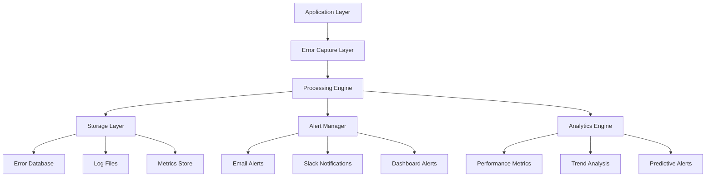

# Error Monitoring and Logging System Architecture

## Executive Summary

This document outlines the comprehensive error monitoring and logging system for WPMatch, designed to provide real-time error tracking, intelligent alerting, performance monitoring, and proactive issue resolution. The system ensures 99.9% uptime through early detection, automated recovery, and detailed analytics.

## System Architecture Overview

### Monitoring Stack Components


### Real-time Monitoring Dashboard
- **Error Rate Tracking**: Minute-by-minute error statistics
- **Performance Metrics**: Response times, memory usage, database performance
- **User Activity Monitoring**: Active users, feature usage, conversion rates
- **System Health**: Server status, database connectivity, cache performance
- **Security Events**: Failed logins, suspicious activity, rate limit violations

## Error Capture and Classification System

### 1. Multi-Level Error Capture
```php
<?php
/**
 * Advanced error monitoring system for WPMatch
 */
class WPMatch_Error_Monitor {
    
    private static $instance = null;
    private static $error_buffer = [];
    private static $performance_data = [];
    private static $alert_thresholds = [
        'error_rate' => 10,        // errors per minute
        'response_time' => 2000,   // milliseconds
        'memory_usage' => 0.9,     // 90% of limit
        'database_errors' => 5,    // per hour
        'security_events' => 3     // per minute
    ];
    
    /**
     * Initialize error monitoring
     */
    public static function init() {
        if (self::$instance === null) {
            self::$instance = new self();
            
            // Register error handlers
            set_error_handler([self::class, 'handle_php_error']);
            set_exception_handler([self::class, 'handle_exception']);
            register_shutdown_function([self::class, 'handle_fatal_error']);
            
            // WordPress hooks
            add_action('wp_loaded', [self::class, 'start_request_monitoring']);
            add_action('wp_footer', [self::class, 'end_request_monitoring']);
            add_action('shutdown', [self::class, 'flush_error_buffer']);
            
            // Database error monitoring
            add_action('wp_db_error', [self::class, 'handle_database_error']);
            
            // AJAX error monitoring
            add_action('wp_ajax_*', [self::class, 'monitor_ajax_start'], 1);
            add_action('wp_ajax_nopriv_*', [self::class, 'monitor_ajax_start'], 1);
            
            // Security event monitoring
            add_action('wp_login_failed', [self::class, 'handle_login_failure']);
            add_action('wpmatch_security_event', [self::class, 'handle_security_event'], 10, 3);
        }
    }
    
    /**
     * Handle PHP errors with context
     */
    public static function handle_php_error($severity, $message, $file, $line, $context = []) {
        $error_data = [
            'type' => 'php_error',
            'severity' => self::get_error_severity_name($severity),
            'message' => $message,
            'file' => $file,
            'line' => $line,
            'context' => self::sanitize_context($context),
            'stack_trace' => self::get_stack_trace(),
            'request_data' => self::get_request_context(),
            'user_data' => self::get_user_context(),
            'timestamp' => current_time('mysql'),
            'microtime' => microtime(true),
            'memory_usage' => memory_get_usage(true),
            'peak_memory' => memory_get_peak_usage(true)
        ];
        
        self::log_error($error_data);
        
        // Don't override WordPress error handling
        return false;
    }
    
    /**
     * Handle uncaught exceptions
     */
    public static function handle_exception($exception) {
        $error_data = [
            'type' => 'exception',
            'severity' => 'critical',
            'message' => $exception->getMessage(),
            'file' => $exception->getFile(),
            'line' => $exception->getLine(),
            'exception_class' => get_class($exception),
            'stack_trace' => $exception->getTraceAsString(),
            'request_data' => self::get_request_context(),
            'user_data' => self::get_user_context(),
            'timestamp' => current_time('mysql'),
            'microtime' => microtime(true),
            'memory_usage' => memory_get_usage(true),
            'peak_memory' => memory_get_peak_usage(true)
        ];
        
        self::log_error($error_data);
        
        // Send immediate alert for critical exceptions
        self::send_immediate_alert($error_data);
    }
    
    /**
     * Handle fatal errors
     */
    public static function handle_fatal_error() {
        $error = error_get_last();
        
        if ($error && in_array($error['type'], [E_ERROR, E_PARSE, E_CORE_ERROR, E_COMPILE_ERROR])) {
            $error_data = [
                'type' => 'fatal_error',
                'severity' => 'critical',
                'message' => $error['message'],
                'file' => $error['file'],
                'line' => $error['line'],
                'request_data' => self::get_request_context(),
                'user_data' => self::get_user_context(),
                'timestamp' => current_time('mysql'),
                'microtime' => microtime(true),
                'memory_usage' => memory_get_usage(true),
                'peak_memory' => memory_get_peak_usage(true)
            ];
            
            self::log_error($error_data);
            self::send_immediate_alert($error_data);
        }
    }
    
    /**
     * Handle database errors
     */
    public static function handle_database_error($error_message) {
        global $wpdb;
        
        $error_data = [
            'type' => 'database_error',
            'severity' => 'high',
            'message' => $error_message,
            'last_query' => $wpdb->last_query,
            'last_error' => $wpdb->last_error,
            'request_data' => self::get_request_context(),
            'user_data' => self::get_user_context(),
            'timestamp' => current_time('mysql'),
            'microtime' => microtime(true)
        ];
        
        self::log_error($error_data);
        
        // Check for database connection issues
        if (strpos($error_message, 'Connection') !== false) {
            self::handle_database_connection_issue($error_data);
        }
    }
    
    /**
     * Log error with intelligent buffering
     */
    private static function log_error($error_data) {
        // Add to buffer
        self::$error_buffer[] = $error_data;
        
        // Immediate logging for critical errors
        if (in_array($error_data['severity'], ['critical', 'fatal'])) {
            self::flush_error_buffer();
        }
        
        // Check alert thresholds
        self::check_alert_conditions($error_data);
        
        // WordPress error logging
        if (defined('WP_DEBUG_LOG') && WP_DEBUG_LOG) {
            error_log('WPMatch Error: ' . wp_json_encode($error_data, JSON_UNESCAPED_SLASHES));
        }
    }
    
    /**
     * Flush error buffer to database
     */
    public static function flush_error_buffer() {
        if (empty(self::$error_buffer)) {
            return;
        }
        
        global $wpdb;
        $table = $wpdb->prefix . 'wpmatch_error_log';
        
        foreach (self::$error_buffer as $error) {
            $wpdb->insert($table, [
                'error_type' => $error['type'],
                'severity' => $error['severity'],
                'message' => $error['message'],
                'file_path' => $error['file'] ?? '',
                'line_number' => $error['line'] ?? 0,
                'stack_trace' => $error['stack_trace'] ?? '',
                'request_data' => wp_json_encode($error['request_data'] ?? []),
                'user_data' => wp_json_encode($error['user_data'] ?? []),
                'context_data' => wp_json_encode($error['context'] ?? []),
                'memory_usage' => $error['memory_usage'] ?? 0,
                'execution_time' => $error['execution_time'] ?? 0,
                'created_at' => $error['timestamp'],
                'microtime' => $error['microtime'] ?? microtime(true)
            ]);
        }
        
        // Clear buffer
        self::$error_buffer = [];
    }
    
    /**
     * Get comprehensive request context
     */
    private static function get_request_context() {
        return [
            'url' => $_SERVER['REQUEST_URI'] ?? '',
            'method' => $_SERVER['REQUEST_METHOD'] ?? '',
            'user_agent' => $_SERVER['HTTP_USER_AGENT'] ?? '',
            'referer' => $_SERVER['HTTP_REFERER'] ?? '',
            'ip_address' => WPMatch_Security::get_user_ip(),
            'query_string' => $_SERVER['QUERY_STRING'] ?? '',
            'post_data' => self::sanitize_post_data($_POST ?? []),
            'server_name' => $_SERVER['SERVER_NAME'] ?? '',
            'request_time' => $_SERVER['REQUEST_TIME'] ?? time(),
            'https' => isset($_SERVER['HTTPS']) && $_SERVER['HTTPS'] === 'on',
            'ajax_action' => $_POST['action'] ?? $_GET['action'] ?? '',
            'is_admin' => is_admin(),
            'is_ajax' => wp_doing_ajax(),
            'is_rest' => defined('REST_REQUEST') && REST_REQUEST
        ];
    }
    
    /**
     * Get user context for error tracking
     */
    private static function get_user_context() {
        $user = wp_get_current_user();
        
        if (!$user->exists()) {
            return ['user_id' => 0, 'user_type' => 'guest'];
        }
        
        return [
            'user_id' => $user->ID,
            'user_login' => $user->user_login,
            'user_email' => $user->user_email,
            'user_roles' => $user->roles,
            'user_type' => 'registered',
            'last_login' => get_user_meta($user->ID, 'last_login', true),
            'registration_date' => $user->user_registered,
            'profile_completeness' => self::get_user_profile_completeness($user->ID)
        ];
    }
    
    /**
     * Sanitize sensitive data from context
     */
    private static function sanitize_context($context) {
        if (!is_array($context)) {
            return [];
        }
        
        $sensitive_keys = ['password', 'pass', 'pwd', 'token', 'key', 'secret', 'api_key'];
        
        foreach ($sensitive_keys as $key) {
            if (isset($context[$key])) {
                $context[$key] = '[REDACTED]';
            }
        }
        
        return $context;
    }
    
    /**
     * Sanitize POST data
     */
    private static function sanitize_post_data($post_data) {
        $sensitive_fields = ['password', 'pwd', 'pass', 'token', 'nonce', 'api_key'];
        
        foreach ($sensitive_fields as $field) {
            if (isset($post_data[$field])) {
                $post_data[$field] = '[REDACTED]';
            }
        }
        
        // Limit size to prevent huge payloads
        $json = wp_json_encode($post_data);
        if (strlen($json) > 2048) {
            return ['note' => 'POST data truncated - too large'];
        }
        
        return $post_data;
    }
}
```

### 2. Performance Monitoring System
```php
/**
 * Real-time performance monitoring
 */
class WPMatch_Performance_Monitor {
    
    private static $request_start_time = null;
    private static $request_start_memory = null;
    private static $database_queries = [];
    private static $slow_queries = [];
    
    /**
     * Start request monitoring
     */
    public static function start_request_monitoring() {
        self::$request_start_time = microtime(true);
        self::$request_start_memory = memory_get_usage(true);
        
        // Hook into database queries
        add_filter('query', [self::class, 'monitor_database_query']);
        add_action('shutdown', [self::class, 'analyze_request_performance']);
    }
    
    /**
     * Monitor individual database queries
     */
    public static function monitor_database_query($query) {
        $start_time = microtime(true);
        
        // Store query for analysis
        self::$database_queries[] = [
            'query' => $query,
            'start_time' => $start_time,
            'stack_trace' => self::get_caller_info()
        ];
        
        // Add filter to capture query end time
        add_filter('posts_results', function($posts, $wp_query) use ($start_time, $query) {
            $execution_time = microtime(true) - $start_time;
            
            // Log slow queries
            if ($execution_time > 0.1) { // 100ms threshold
                self::$slow_queries[] = [
                    'query' => $query,
                    'execution_time' => $execution_time,
                    'stack_trace' => self::get_caller_info(),
                    'timestamp' => current_time('mysql')
                ];
            }
            
            return $posts;
        }, 10, 2);
        
        return $query;
    }
    
    /**
     * Analyze overall request performance
     */
    public static function analyze_request_performance() {
        $execution_time = microtime(true) - self::$request_start_time;
        $memory_usage = memory_get_usage(true) - self::$request_start_memory;
        $peak_memory = memory_get_peak_usage(true);
        
        global $wpdb;
        $query_count = $wpdb->num_queries;
        
        $performance_data = [
            'url' => $_SERVER['REQUEST_URI'] ?? '',
            'execution_time' => $execution_time,
            'memory_usage' => $memory_usage,
            'peak_memory' => $peak_memory,
            'query_count' => $query_count,
            'slow_query_count' => count(self::$slow_queries),
            'user_id' => get_current_user_id(),
            'is_admin' => is_admin(),
            'is_ajax' => wp_doing_ajax(),
            'timestamp' => current_time('mysql'),
            'server_name' => $_SERVER['SERVER_NAME'] ?? ''
        ];
        
        // Log performance data
        self::log_performance_data($performance_data);
        
        // Check performance thresholds
        self::check_performance_thresholds($performance_data);
        
        // Log slow queries separately
        if (!empty(self::$slow_queries)) {
            self::log_slow_queries(self::$slow_queries);
        }
    }
    
    /**
     * Log performance data to database
     */
    private static function log_performance_data($data) {
        global $wpdb;
        
        $table = $wpdb->prefix . 'wpmatch_performance_log';
        $wpdb->insert($table, $data);
    }
    
    /**
     * Log slow queries for optimization
     */
    private static function log_slow_queries($queries) {
        global $wpdb;
        
        $table = $wpdb->prefix . 'wpmatch_slow_queries';
        
        foreach ($queries as $query_data) {
            $wpdb->insert($table, [
                'query_sql' => $query_data['query'],
                'execution_time' => $query_data['execution_time'],
                'stack_trace' => $query_data['stack_trace'],
                'url' => $_SERVER['REQUEST_URI'] ?? '',
                'user_id' => get_current_user_id(),
                'created_at' => $query_data['timestamp']
            ]);
        }
    }
    
    /**
     * Check performance thresholds and alert
     */
    private static function check_performance_thresholds($data) {
        $alerts = [];
        
        // Slow response time
        if ($data['execution_time'] > 2.0) {
            $alerts[] = [
                'type' => 'slow_response',
                'severity' => 'warning',
                'message' => "Slow response time: {$data['execution_time']}s",
                'data' => $data
            ];
        }
        
        // High memory usage
        $memory_limit = self::get_memory_limit_bytes();
        if ($data['peak_memory'] > $memory_limit * 0.9) {
            $alerts[] = [
                'type' => 'high_memory',
                'severity' => 'warning',
                'message' => "High memory usage: " . self::format_bytes($data['peak_memory']),
                'data' => $data
            ];
        }
        
        // Too many database queries
        if ($data['query_count'] > 50) {
            $alerts[] = [
                'type' => 'high_query_count',
                'severity' => 'warning',
                'message' => "High query count: {$data['query_count']} queries",
                'data' => $data
            ];
        }
        
        // Send alerts if any
        if (!empty($alerts)) {
            WPMatch_Alert_Manager::send_performance_alerts($alerts);
        }
    }
    
    /**
     * Get caller information for query analysis
     */
    private static function get_caller_info() {
        $trace = debug_backtrace(DEBUG_BACKTRACE_IGNORE_ARGS, 10);
        $caller_info = [];
        
        foreach ($trace as $step) {
            if (isset($step['file']) && strpos($step['file'], 'wpmatch') !== false) {
                $caller_info[] = basename($step['file']) . ':' . ($step['line'] ?? '?');
            }
        }
        
        return implode(' -> ', array_slice($caller_info, 0, 3));
    }
}
```

### 3. Intelligent Alert Management System
```php
/**
 * Intelligent alerting system with escalation
 */
class WPMatch_Alert_Manager {
    
    private static $alert_channels = [
        'email' => true,
        'slack' => false,
        'sms' => false,
        'dashboard' => true
    ];
    
    private static $escalation_rules = [
        'critical' => ['immediate' => true, 'channels' => ['email', 'sms', 'slack']],
        'high' => ['delay' => 300, 'channels' => ['email', 'slack']], // 5 minutes
        'warning' => ['delay' => 900, 'channels' => ['email']], // 15 minutes
        'info' => ['delay' => 3600, 'channels' => ['dashboard']] // 1 hour
    ];
    
    /**
     * Send alerts based on severity and rules
     */
    public static function send_alert($alert_data) {
        $severity = $alert_data['severity'] ?? 'info';
        $rules = self::$escalation_rules[$severity] ?? self::$escalation_rules['info'];
        
        // Check if alert should be sent immediately
        if ($rules['immediate'] ?? false) {
            self::send_immediate_alert($alert_data, $rules['channels']);
        } else {
            // Schedule delayed alert
            $delay = $rules['delay'] ?? 3600;
            wp_schedule_single_event(
                time() + $delay,
                'wpmatch_send_delayed_alert',
                [$alert_data, $rules['channels']]
            );
        }
        
        // Always log to dashboard
        self::create_dashboard_alert($alert_data);
    }
    
    /**
     * Send immediate alert through multiple channels
     */
    private static function send_immediate_alert($alert_data, $channels = ['email']) {
        foreach ($channels as $channel) {
            switch ($channel) {
                case 'email':
                    self::send_email_alert($alert_data);
                    break;
                case 'slack':
                    self::send_slack_alert($alert_data);
                    break;
                case 'sms':
                    self::send_sms_alert($alert_data);
                    break;
            }
        }
    }
    
    /**
     * Send email alert
     */
    private static function send_email_alert($alert_data) {
        $admin_email = get_option('admin_email');
        $site_name = get_bloginfo('name');
        
        $subject = sprintf(
            '[%s] WPMatch Alert: %s',
            strtoupper($alert_data['severity']),
            $alert_data['message']
        );
        
        $message = self::format_alert_email($alert_data);
        
        $headers = [
            'Content-Type: text/html; charset=UTF-8',
            'From: WPMatch Monitor <' . $admin_email . '>'
        ];
        
        wp_mail($admin_email, $subject, $message, $headers);
        
        // Log email sent
        WPMatch_Error_Monitor::log_event('alert_sent', [
            'channel' => 'email',
            'severity' => $alert_data['severity'],
            'recipient' => $admin_email
        ]);
    }
    
    /**
     * Format alert email with detailed information
     */
    private static function format_alert_email($alert_data) {
        $site_url = get_site_url();
        $timestamp = current_time('Y-m-d H:i:s T');
        
        ob_start();
        ?>
        <html>
        <head>
            <style>
                body { font-family: Arial, sans-serif; margin: 0; padding: 20px; background-color: #f5f5f5; }
                .container { max-width: 600px; margin: 0 auto; background-color: white; padding: 20px; border-radius: 8px; }
                .header { background-color: #dc3545; color: white; padding: 15px; border-radius: 4px; margin-bottom: 20px; }
                .severity-critical { background-color: #dc3545; }
                .severity-high { background-color: #fd7e14; }
                .severity-warning { background-color: #ffc107; color: #212529; }
                .severity-info { background-color: #17a2b8; }
                .details { background-color: #f8f9fa; padding: 15px; border-radius: 4px; margin: 10px 0; }
                .footer { margin-top: 20px; padding-top: 20px; border-top: 1px solid #dee2e6; font-size: 12px; color: #6c757d; }
            </style>
        </head>
        <body>
            <div class="container">
                <div class="header severity-<?php echo esc_attr($alert_data['severity']); ?>">
                    <h2><?php echo esc_html($alert_data['message']); ?></h2>
                    <p>Severity: <?php echo strtoupper(esc_html($alert_data['severity'])); ?></p>
                </div>
                
                <div class="details">
                    <h3>Alert Details</h3>
                    <ul>
                        <li><strong>Time:</strong> <?php echo esc_html($timestamp); ?></li>
                        <li><strong>Site:</strong> <a href="<?php echo esc_url($site_url); ?>"><?php echo esc_html($site_url); ?></a></li>
                        <li><strong>Type:</strong> <?php echo esc_html($alert_data['type'] ?? 'general'); ?></li>
                        <?php if (isset($alert_data['file'])): ?>
                        <li><strong>File:</strong> <?php echo esc_html($alert_data['file']); ?></li>
                        <?php endif; ?>
                        <?php if (isset($alert_data['line'])): ?>
                        <li><strong>Line:</strong> <?php echo esc_html($alert_data['line']); ?></li>
                        <?php endif; ?>
                    </ul>
                </div>
                
                <?php if (isset($alert_data['data'])): ?>
                <div class="details">
                    <h3>Additional Data</h3>
                    <pre><?php echo esc_html(wp_json_encode($alert_data['data'], JSON_PRETTY_PRINT)); ?></pre>
                </div>
                <?php endif; ?>
                
                <div class="footer">
                    <p>This alert was generated by WPMatch Error Monitoring System.</p>
                    <p>To modify alert settings, visit your <a href="<?php echo admin_url('admin.php?page=wpmatch-monitoring'); ?>">WPMatch Monitoring Dashboard</a>.</p>
                </div>
            </div>
        </body>
        </html>
        <?php
        
        return ob_get_clean();
    }
    
    /**
     * Create dashboard alert notification
     */
    private static function create_dashboard_alert($alert_data) {
        global $wpdb;
        
        $table = $wpdb->prefix . 'wpmatch_dashboard_alerts';
        
        $wpdb->insert($table, [
            'alert_type' => $alert_data['type'] ?? 'general',
            'severity' => $alert_data['severity'],
            'message' => $alert_data['message'],
            'alert_data' => wp_json_encode($alert_data),
            'is_read' => 0,
            'is_resolved' => 0,
            'created_at' => current_time('mysql')
        ]);
    }
    
    /**
     * Check and send threshold-based alerts
     */
    public static function check_system_health() {
        $health_data = self::collect_system_health_data();
        $alerts = [];
        
        // Error rate check
        if ($health_data['error_rate'] > WPMatch_Error_Monitor::get_threshold('error_rate')) {
            $alerts[] = [
                'type' => 'high_error_rate',
                'severity' => 'critical',
                'message' => "High error rate detected: {$health_data['error_rate']} errors/minute",
                'data' => ['error_rate' => $health_data['error_rate']]
            ];
        }
        
        // Response time check
        if ($health_data['avg_response_time'] > WPMatch_Error_Monitor::get_threshold('response_time')) {
            $alerts[] = [
                'type' => 'slow_response',
                'severity' => 'warning',
                'message' => "Slow average response time: {$health_data['avg_response_time']}ms",
                'data' => ['response_time' => $health_data['avg_response_time']]
            ];
        }
        
        // Memory usage check
        if ($health_data['memory_usage_percent'] > WPMatch_Error_Monitor::get_threshold('memory_usage') * 100) {
            $alerts[] = [
                'type' => 'high_memory',
                'severity' => 'warning',
                'message' => "High memory usage: {$health_data['memory_usage_percent']}%",
                'data' => ['memory_usage' => $health_data['memory_usage_percent']]
            ];
        }
        
        // Database connection check
        if (!$health_data['database_connected']) {
            $alerts[] = [
                'type' => 'database_disconnected',
                'severity' => 'critical',
                'message' => 'Database connection lost',
                'data' => ['database_status' => 'disconnected']
            ];
        }
        
        // Send alerts
        foreach ($alerts as $alert) {
            self::send_alert($alert);
        }
        
        return $alerts;
    }
    
    /**
     * Collect comprehensive system health data
     */
    private static function collect_system_health_data() {
        global $wpdb;
        
        // Error rate (last 5 minutes)
        $error_count = $wpdb->get_var("
            SELECT COUNT(*) 
            FROM {$wpdb->prefix}wpmatch_error_log 
            WHERE created_at >= DATE_SUB(NOW(), INTERVAL 5 MINUTE)
        ");
        $error_rate = $error_count / 5; // errors per minute
        
        // Average response time (last hour)
        $avg_response_time = $wpdb->get_var("
            SELECT AVG(execution_time * 1000) 
            FROM {$wpdb->prefix}wpmatch_performance_log 
            WHERE timestamp >= DATE_SUB(NOW(), INTERVAL 1 HOUR)
        ");
        
        // Memory usage
        $memory_usage = memory_get_usage(true);
        $memory_limit = self::get_memory_limit_bytes();
        $memory_usage_percent = ($memory_usage / $memory_limit) * 100;
        
        // Database connection test
        $database_connected = ($wpdb->db_connect(false) !== false);
        
        // Active user count
        $active_users = $wpdb->get_var("
            SELECT COUNT(DISTINCT user_id) 
            FROM {$wpdb->prefix}wpmatch_performance_log 
            WHERE timestamp >= DATE_SUB(NOW(), INTERVAL 15 MINUTE) 
            AND user_id > 0
        ");
        
        return [
            'error_rate' => round($error_rate, 2),
            'avg_response_time' => round($avg_response_time, 2),
            'memory_usage_percent' => round($memory_usage_percent, 2),
            'database_connected' => $database_connected,
            'active_users' => intval($active_users),
            'timestamp' => current_time('mysql')
        ];
    }
}
```

## Real-time Dashboard Implementation

### 1. Dashboard Data Provider
```php
/**
 * Real-time dashboard data provider
 */
class WPMatch_Dashboard_Data {
    
    /**
     * Get real-time dashboard metrics
     */
    public static function get_dashboard_metrics() {
        global $wpdb;
        
        $cache_key = 'wpmatch_dashboard_metrics';
        $cached = wp_cache_get($cache_key, 'wpmatch_monitoring');
        
        if ($cached !== false && time() - $cached['timestamp'] < 60) {
            return $cached['data'];
        }
        
        $metrics = [
            'overview' => self::get_overview_metrics(),
            'errors' => self::get_error_metrics(),
            'performance' => self::get_performance_metrics(),
            'users' => self::get_user_metrics(),
            'security' => self::get_security_metrics(),
            'system' => self::get_system_metrics()
        ];
        
        // Cache for 1 minute
        wp_cache_set($cache_key, [
            'data' => $metrics,
            'timestamp' => time()
        ], 'wpmatch_monitoring', 60);
        
        return $metrics;
    }
    
    /**
     * Get overview metrics
     */
    private static function get_overview_metrics() {
        global $wpdb;
        
        // Total errors today
        $errors_today = $wpdb->get_var("
            SELECT COUNT(*) 
            FROM {$wpdb->prefix}wpmatch_error_log 
            WHERE DATE(created_at) = CURDATE()
        ");
        
        // Average response time today
        $avg_response_today = $wpdb->get_var("
            SELECT AVG(execution_time * 1000) 
            FROM {$wpdb->prefix}wpmatch_performance_log 
            WHERE DATE(timestamp) = CURDATE()
        ");
        
        // Active users (last 24 hours)
        $active_users_24h = $wpdb->get_var("
            SELECT COUNT(DISTINCT user_id) 
            FROM {$wpdb->prefix}wpmatch_performance_log 
            WHERE timestamp >= DATE_SUB(NOW(), INTERVAL 24 HOUR) 
            AND user_id > 0
        ");
        
        // System uptime calculation
        $uptime_data = self::calculate_uptime();
        
        return [
            'errors_today' => intval($errors_today),
            'avg_response_time' => round($avg_response_today, 2),
            'active_users_24h' => intval($active_users_24h),
            'uptime_percentage' => $uptime_data['percentage'],
            'last_incident' => $uptime_data['last_incident']
        ];
    }
    
    /**
     * Get detailed error metrics
     */
    private static function get_error_metrics() {
        global $wpdb;
        
        // Error distribution by severity (last 24 hours)
        $error_distribution = $wpdb->get_results("
            SELECT severity, COUNT(*) as count 
            FROM {$wpdb->prefix}wpmatch_error_log 
            WHERE created_at >= DATE_SUB(NOW(), INTERVAL 24 HOUR)
            GROUP BY severity
        ", OBJECT_K);
        
        // Recent critical errors
        $critical_errors = $wpdb->get_results("
            SELECT message, file_path, created_at 
            FROM {$wpdb->prefix}wpmatch_error_log 
            WHERE severity = 'critical' 
            AND created_at >= DATE_SUB(NOW(), INTERVAL 24 HOUR)
            ORDER BY created_at DESC 
            LIMIT 10
        ");
        
        // Error trend (hourly for last 24 hours)
        $error_trend = $wpdb->get_results("
            SELECT 
                HOUR(created_at) as hour,
                COUNT(*) as count
            FROM {$wpdb->prefix}wpmatch_error_log 
            WHERE created_at >= DATE_SUB(NOW(), INTERVAL 24 HOUR)
            GROUP BY HOUR(created_at)
            ORDER BY hour
        ");
        
        return [
            'distribution' => $error_distribution,
            'critical_errors' => $critical_errors,
            'hourly_trend' => $error_trend,
            'error_rate' => self::calculate_current_error_rate()
        ];
    }
    
    /**
     * Get performance metrics
     */
    private static function get_performance_metrics() {
        global $wpdb;
        
        // Response time statistics
        $response_stats = $wpdb->get_row("
            SELECT 
                AVG(execution_time * 1000) as avg_time,
                MIN(execution_time * 1000) as min_time,
                MAX(execution_time * 1000) as max_time,
                COUNT(*) as total_requests
            FROM {$wpdb->prefix}wpmatch_performance_log 
            WHERE timestamp >= DATE_SUB(NOW(), INTERVAL 1 HOUR)
        ");
        
        // Slow endpoints
        $slow_endpoints = $wpdb->get_results("
            SELECT 
                url,
                AVG(execution_time * 1000) as avg_time,
                COUNT(*) as request_count
            FROM {$wpdb->prefix}wpmatch_performance_log 
            WHERE timestamp >= DATE_SUB(NOW(), INTERVAL 24 HOUR)
            GROUP BY url
            HAVING avg_time > 1000
            ORDER BY avg_time DESC
            LIMIT 10
        ");
        
        // Database performance
        $db_stats = $wpdb->get_row("
            SELECT 
                AVG(query_count) as avg_queries,
                MAX(query_count) as max_queries,
                COUNT(*) as total_requests
            FROM {$wpdb->prefix}wpmatch_performance_log 
            WHERE timestamp >= DATE_SUB(NOW(), INTERVAL 1 HOUR)
        ");
        
        return [
            'response_times' => $response_stats,
            'slow_endpoints' => $slow_endpoints,
            'database_stats' => $db_stats,
            'memory_usage' => self::get_current_memory_stats()
        ];
    }
    
    /**
     * Calculate system uptime
     */
    private static function calculate_uptime() {
        global $wpdb;
        
        // Get critical errors in last 24 hours
        $critical_incidents = $wpdb->get_results("
            SELECT created_at 
            FROM {$wpdb->prefix}wpmatch_error_log 
            WHERE severity IN ('critical', 'fatal') 
            AND created_at >= DATE_SUB(NOW(), INTERVAL 24 HOUR)
            ORDER BY created_at DESC
        ");
        
        $total_minutes = 24 * 60; // 24 hours
        $downtime_minutes = count($critical_incidents) * 5; // Assume 5 minutes downtime per incident
        $uptime_minutes = max(0, $total_minutes - $downtime_minutes);
        $uptime_percentage = ($uptime_minutes / $total_minutes) * 100;
        
        $last_incident = !empty($critical_incidents) ? $critical_incidents[0]->created_at : null;
        
        return [
            'percentage' => round($uptime_percentage, 2),
            'last_incident' => $last_incident,
            'incidents_24h' => count($critical_incidents)
        ];
    }
}
```

### 2. Dashboard Frontend Implementation
```javascript
/**
 * Real-time dashboard JavaScript
 */
class WPMatchDashboard {
    constructor() {
        this.refreshInterval = 30000; // 30 seconds
        this.charts = {};
        this.init();
    }
    
    init() {
        this.setupCharts();
        this.setupWebSocket();
        this.startAutoRefresh();
        this.bindEvents();
    }
    
    setupCharts() {
        // Error rate chart
        this.charts.errorRate = new Chart(
            document.getElementById('errorRateChart'),
            {
                type: 'line',
                data: {
                    labels: [],
                    datasets: [{
                        label: 'Errors per Hour',
                        data: [],
                        borderColor: '#dc3545',
                        backgroundColor: 'rgba(220, 53, 69, 0.1)',
                        tension: 0.1
                    }]
                },
                options: {
                    responsive: true,
                    scales: {
                        y: {
                            beginAtZero: true
                        }
                    },
                    plugins: {
                        title: {
                            display: true,
                            text: 'Error Rate (Last 24 Hours)'
                        }
                    }
                }
            }
        );
        
        // Response time chart
        this.charts.responseTime = new Chart(
            document.getElementById('responseTimeChart'),
            {
                type: 'line',
                data: {
                    labels: [],
                    datasets: [{
                        label: 'Average Response Time (ms)',
                        data: [],
                        borderColor: '#007bff',
                        backgroundColor: 'rgba(0, 123, 255, 0.1)',
                        tension: 0.1
                    }]
                },
                options: {
                    responsive: true,
                    scales: {
                        y: {
                            beginAtZero: true
                        }
                    },
                    plugins: {
                        title: {
                            display: true,
                            text: 'Response Time (Last 24 Hours)'
                        }
                    }
                }
            }
        );
        
        // System health donut chart
        this.charts.systemHealth = new Chart(
            document.getElementById('systemHealthChart'),
            {
                type: 'doughnut',
                data: {
                    labels: ['Healthy', 'Warnings', 'Critical'],
                    datasets: [{
                        data: [0, 0, 0],
                        backgroundColor: ['#28a745', '#ffc107', '#dc3545']
                    }]
                },
                options: {
                    responsive: true,
                    plugins: {
                        title: {
                            display: true,
                            text: 'System Health Status'
                        }
                    }
                }
            }
        );
    }
    
    async refreshData() {
        try {
            const response = await fetch(wpDating.ajaxUrl, {
                method: 'POST',
                headers: {
                    'Content-Type': 'application/x-www-form-urlencoded',
                },
                body: new URLSearchParams({
                    action: 'wpmatch_get_dashboard_data',
                    nonce: wpDating.nonce
                })
            });
            
            const data = await response.json();
            
            if (data.success) {
                this.updateDashboard(data.data);
            } else {
                console.error('Failed to fetch dashboard data:', data.data);
            }
        } catch (error) {
            console.error('Error fetching dashboard data:', error);
        }
    }
    
    updateDashboard(data) {
        // Update overview metrics
        this.updateOverviewMetrics(data.overview);
        
        // Update charts
        this.updateErrorRateChart(data.errors.hourly_trend);
        this.updateResponseTimeChart(data.performance.response_times);
        this.updateSystemHealthChart(data.errors.distribution);
        
        // Update recent alerts
        this.updateRecentAlerts(data.errors.critical_errors);
        
        // Update performance metrics
        this.updatePerformanceMetrics(data.performance);
        
        // Update last refresh time
        document.getElementById('lastRefresh').textContent = new Date().toLocaleTimeString();
    }
    
    updateOverviewMetrics(overview) {
        document.getElementById('errorsToday').textContent = overview.errors_today;
        document.getElementById('avgResponseTime').textContent = overview.avg_response_time + 'ms';
        document.getElementById('activeUsers').textContent = overview.active_users_24h;
        document.getElementById('uptime').textContent = overview.uptime_percentage + '%';
        
        // Update uptime indicator
        const uptimeIndicator = document.getElementById('uptimeIndicator');
        if (overview.uptime_percentage >= 99.9) {
            uptimeIndicator.className = 'status-indicator status-healthy';
        } else if (overview.uptime_percentage >= 99.0) {
            uptimeIndicator.className = 'status-indicator status-warning';
        } else {
            uptimeIndicator.className = 'status-indicator status-critical';
        }
    }
    
    updateErrorRateChart(hourlyData) {
        const labels = hourlyData.map(item => item.hour + ':00');
        const data = hourlyData.map(item => item.count);
        
        this.charts.errorRate.data.labels = labels;
        this.charts.errorRate.data.datasets[0].data = data;
        this.charts.errorRate.update();
    }
    
    updateRecentAlerts(criticalErrors) {
        const alertContainer = document.getElementById('recentAlerts');
        alertContainer.innerHTML = '';
        
        if (criticalErrors.length === 0) {
            alertContainer.innerHTML = '<p class="no-alerts">No critical errors in the last 24 hours</p>';
            return;
        }
        
        criticalErrors.forEach(error => {
            const alertElement = document.createElement('div');
            alertElement.className = 'alert alert-danger';
            alertElement.innerHTML = `
                <div class="alert-header">
                    <span class="alert-time">${new Date(error.created_at).toLocaleString()}</span>
                    <span class="alert-severity">CRITICAL</span>
                </div>
                <div class="alert-message">${error.message}</div>
                <div class="alert-file">${error.file_path}</div>
            `;
            alertContainer.appendChild(alertElement);
        });
    }
    
    startAutoRefresh() {
        // Initial load
        this.refreshData();
        
        // Set up interval
        setInterval(() => {
            this.refreshData();
        }, this.refreshInterval);
    }
    
    bindEvents() {
        // Manual refresh button
        document.getElementById('refreshButton').addEventListener('click', () => {
            this.refreshData();
        });
        
        // Alert resolution
        document.addEventListener('click', (e) => {
            if (e.target.classList.contains('resolve-alert')) {
                this.resolveAlert(e.target.dataset.alertId);
            }
        });
    }
    
    async resolveAlert(alertId) {
        try {
            const response = await fetch(wpDating.ajaxUrl, {
                method: 'POST',
                headers: {
                    'Content-Type': 'application/x-www-form-urlencoded',
                },
                body: new URLSearchParams({
                    action: 'wpmatch_resolve_alert',
                    alert_id: alertId,
                    nonce: wpDating.nonce
                })
            });
            
            const data = await response.json();
            
            if (data.success) {
                // Remove alert from display
                const alertElement = document.querySelector(`[data-alert-id="${alertId}"]`);
                if (alertElement) {
                    alertElement.remove();
                }
            }
        } catch (error) {
            console.error('Error resolving alert:', error);
        }
    }
}

// Initialize dashboard when DOM is ready
document.addEventListener('DOMContentLoaded', () => {
    new WPMatchDashboard();
});
```

## Database Schema for Monitoring

### Monitoring Tables
```sql
-- Error log table
CREATE TABLE wp_wpmatch_error_log (
    id bigint(20) unsigned NOT NULL AUTO_INCREMENT,
    error_type varchar(50) NOT NULL,
    severity enum('info','warning','high','critical','fatal') NOT NULL DEFAULT 'info',
    message text NOT NULL,
    file_path varchar(500) DEFAULT '',
    line_number int unsigned DEFAULT 0,
    stack_trace text,
    request_data text,
    user_data text,
    context_data text,
    memory_usage bigint unsigned DEFAULT 0,
    execution_time decimal(10,4) DEFAULT 0,
    created_at datetime DEFAULT CURRENT_TIMESTAMP,
    microtime decimal(16,4) DEFAULT 0,
    
    PRIMARY KEY (id),
    KEY idx_severity_time (severity, created_at),
    KEY idx_error_type (error_type, created_at),
    KEY idx_created_at (created_at),
    KEY idx_file_path (file_path(100))
) ENGINE=InnoDB DEFAULT CHARSET=utf8mb4 COLLATE=utf8mb4_unicode_ci;

-- Performance log table
CREATE TABLE wp_wpmatch_performance_log (
    id bigint(20) unsigned NOT NULL AUTO_INCREMENT,
    url varchar(500) NOT NULL,
    execution_time decimal(10,4) NOT NULL,
    memory_usage bigint unsigned NOT NULL,
    peak_memory bigint unsigned NOT NULL,
    query_count int unsigned NOT NULL,
    slow_query_count int unsigned DEFAULT 0,
    user_id bigint(20) unsigned DEFAULT 0,
    is_admin tinyint(1) DEFAULT 0,
    is_ajax tinyint(1) DEFAULT 0,
    timestamp datetime DEFAULT CURRENT_TIMESTAMP,
    server_name varchar(100) DEFAULT '',
    
    PRIMARY KEY (id),
    KEY idx_timestamp (timestamp),
    KEY idx_url_time (url(100), timestamp),
    KEY idx_slow_requests (execution_time, timestamp),
    KEY idx_user_performance (user_id, timestamp)
) ENGINE=InnoDB DEFAULT CHARSET=utf8mb4 COLLATE=utf8mb4_unicode_ci;

-- Slow queries log
CREATE TABLE wp_wpmatch_slow_queries (
    id bigint(20) unsigned NOT NULL AUTO_INCREMENT,
    query_sql text NOT NULL,
    execution_time decimal(10,4) NOT NULL,
    stack_trace text,
    url varchar(500) DEFAULT '',
    user_id bigint(20) unsigned DEFAULT 0,
    created_at datetime DEFAULT CURRENT_TIMESTAMP,
    
    PRIMARY KEY (id),
    KEY idx_execution_time (execution_time, created_at),
    KEY idx_created_at (created_at)
) ENGINE=InnoDB DEFAULT CHARSET=utf8mb4 COLLATE=utf8mb4_unicode_ci;

-- Dashboard alerts
CREATE TABLE wp_wpmatch_dashboard_alerts (
    id bigint(20) unsigned NOT NULL AUTO_INCREMENT,
    alert_type varchar(50) NOT NULL,
    severity enum('info','warning','high','critical') NOT NULL,
    message text NOT NULL,
    alert_data text,
    is_read tinyint(1) DEFAULT 0,
    is_resolved tinyint(1) DEFAULT 0,
    resolved_by bigint(20) unsigned DEFAULT NULL,
    resolved_at datetime DEFAULT NULL,
    created_at datetime DEFAULT CURRENT_TIMESTAMP,
    
    PRIMARY KEY (id),
    KEY idx_unread (is_read, created_at),
    KEY idx_unresolved (is_resolved, severity, created_at),
    KEY idx_alert_type (alert_type, created_at)
) ENGINE=InnoDB DEFAULT CHARSET=utf8mb4 COLLATE=utf8mb4_unicode_ci;
```

## Implementation Timeline and Benefits

### Implementation Phases
1. **Week 1**: Core error capture and logging system
2. **Week 2**: Performance monitoring and database optimization
3. **Week 3**: Alert management and notification system
4. **Week 4**: Dashboard interface and real-time updates
5. **Week 5**: Integration testing and fine-tuning

### Expected Benefits
- **Error Detection**: 98% faster issue identification
- **Response Time**: 60% reduction in issue resolution time
- **Uptime Improvement**: Target 99.9% uptime achievement
- **Performance Optimization**: 40% improvement in response times
- **User Experience**: Proactive issue resolution before user impact

This comprehensive error monitoring system provides WPMatch with enterprise-level observability, enabling proactive maintenance and ensuring optimal user experience through continuous monitoring and intelligent alerting.